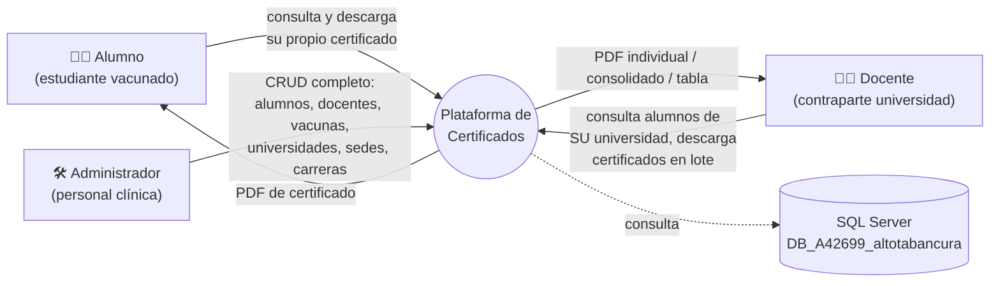

# 00 · Contexto de negocio

## Qué es este sistema

Plataforma web que permite a **estudiantes universitarios vacunados en el vacunatorio
de Procedimientos Clínicos Alto Tabancura** (Av. Tabancura 1515, Vitacura, Santiago,
RUT 76.004.217-K) **descargar su certificado de vacunación en PDF**, y al personal
de la clínica y a las universidades cliente administrar y consultar esa información.

✅ Verificado: el texto del certificado y los datos de contacto están literalmente en
`gate/class/cCertificado.php:27` y `gate/class/cCertificado.php:122-124`.

## Problema que resuelve

| Antes (implícito) | Con el sistema |
|---|---|
| El alumno debía ir presencialmente o pedir por correo su certificado | Se autoservicia 24/7 con su RUT |
| La universidad no tenía visibilidad de qué alumnos cumplían el requisito de vacunación | El docente filtra por sede/carrera/fecha y descarga certificados en lote |
| La clínica llevaba registro manual de dosis por alumno | CRUD de alumnos, vacunas, lotes y dosis |

🔍 Inferido: el "antes" no está documentado en el repositorio; se deduce de las funcionalidades construidas.

## Actores

## Contexto temporal y de propiedad

| Dato | Valor | Fuente |
|---|---|---|
| Autoría del framework | "Njong Alvax" / Alvax Informática (`www.avx.cl`) | comentarios en `valk/*.php`, footer en `gate/omega/xCore.php:124` |
| Fechas en comentarios de código | 09-2018 a 04-2019 | encabezados `NJONG 25.09.18`, `ALVAX 02.04.2019` |
| Primer commit del repositorio | 2021-11-22 (`First upload`) | `git log` |
| Última entrada del log de aplicación | 2019-03-04 | `log.txt` |
| Dominio productivo configurado | `http://vacunatorioaltotabancura.cl/` (**HTTP, sin TLS**) | `manifest.php:14` |
| Hosting inferido | SmarterASP.NET / site4now (IIS + SQL Server) | host de BD `sql7004.site4now.net` en `valk/mu/v1.0/Steins.php:9` |

🔍 Inferido: el sistema parece **anterior a la pandemia de COVID-19** y orientado a
vacunas del programa universitario de salud (p. ej. hepatitis B, influenza) para
estudiantes de carreras del área de la salud que requieren acreditar inmunización
antes de sus prácticas clínicas. El certificado admite dosis 1ª, 2ª y 3ª
(`gate/omega/xUsuario.php:76-88`) y el formato tabla admite hasta 5 dosis
(`gate/class/cCertificado.php:157-166`).

## Reglas de negocio identificadas

| # | Regla | Ubicación | Confianza |
|---|---|---|---|
| RN-01 | La credencial por defecto de un alumno es: **usuario = RUT sin puntos ni dígito verificador**, **contraseña = primeros 4 dígitos del RUT** | `gate/omega/xDashboard.php:229-231` (texto en la portada) | ✅ |
| RN-02 | Un alumno **solo puede tener un certificado si tiene al menos una vacuna registrada**; si no, el PDF sale vacío | `gate/omega/xCertificado.php:16` (`if (!empty($Vacunas))`) | ✅ |
| RN-03 | Cada emisión de certificado se **registra en la BD** con un código de validación | `gate/omega/xCertificado.php:23` → `spIns_Certificado` | ✅ |
| RN-04 | El **código de validación** del certificado es `md5(RUT)` — es determinístico, no cambia entre emisiones | `gate/omega/xCertificado.php:19` | ✅ (⚠️ ver [`08-seguridad.md`](08-seguridad.md) SEC-05) |
| RN-05 | El docente solo ve alumnos de **su** universidad; el filtro se fija desde la sesión | `gate/omega/xDashboard.php:13-15`, `gate/class/cUsuario.php` | ✅ |
| RN-06 | Tras **4 intentos fallidos** de login la cuenta se bloquea | `valk/ro/rLogin.php:60-70` | ✅ (el conteo lo hace el procedimiento almacenado) |
| RN-07 | Una universidad/sede/carrera/vacuna **solo puede eliminarse si su contador de usos es 0** | `gate/omega/xUniversidad.php:76`, `xSede.php:151`, `xCarrera.php:83`, `xVacuna.php:45` | ✅ |
| RN-08 | El botón "formato tabla" (consolidado) solo aparece al seleccionar **más de 5 alumnos** | `gate/js/jxUsuario.js` (`$.CheckClick`) | ✅ |
| RN-09 | Con ≤5 alumnos seleccionados se generan **PDFs individuales**; con >5, un **PDF consolidado** | `gate/js/jxCertificado.js` (`$.GenerarMultiplesCertificados`) | ✅ |
| RN-10 | La posición vertical de la firma en el PDF **depende de la cantidad de vacunas** (1→6+) | `gate/class/cCertificado.php:61-84` | ✅ |
| RN-11 | Los docentes se crean con `IdCarrera = 37` ("Sin Carrera") | `gate/js/jxUsuario.js` (`$.SaveDocente`) | ✅ (valor mágico) |
| RN-12 | La fecha de nacimiento `1900-01-00` / `1900-01-01` representa "sin dato" y se oculta | `gate/omega/xUsuario.php:190`, `test.php:34` | ✅ |

## Glosario del dominio

| Término | Significado en este sistema |
|---|---|
| **Gate** | La aplicación concreta montada sobre el framework. Aquí vale `appcertificados` (`manifest.php:9`). Prefija todas las variables de sesión. |
| **Valk** | El framework PHP propietario (capa de aplicación, ruteo, dispatch). |
| **Steins** | La capa de acceso a datos del framework: resuelve credenciales de BD y ejecuta procedimientos almacenados. |
| **Wiss** | Clase fachada que agrupa todos los "commands" del framework; de ella heredan los modelos del dominio. |
| **Alfa / Omega** | Convención de capas de controlador: `omega` = accesible a cualquier sesión; `alfa` = solo se carga si la sesión es admin. |
| **Alphonse** | El router: traduce URLs a archivos, assets o al dispatcher. |
| **Kirito** | Módulo de mantenimiento (limpieza de caché). También pinta el banner "MODO DEVELOPER". |
| **Snitch** | Inyección de píxeles de analítica (Google Tag / Facebook Pixel). |
| **Watchdog** | Módulo previsto para telemetría de errores; **inoperante** (`Execute()` retorna `1`). |
| **Morty / Zeus / Odin / Kratos** | Módulos del framework: logging, permisos, y dos esqueletos vacíos. |
| **Neodoc** | Entidad de un producto distinto (gestor documental) que quedó copiada en este repositorio. **No se usa**: `gate/class/cNeodoc.php` no está en `gate/construct.php`. |
| **Sede** | Campus/sede de una universidad. Un alumno pertenece a una sede y una carrera. |
| **Lote / Folio** | Número de lote del vial de la vacuna aplicada. |
| **Dosis / Numero** | Número de dosis (1ª, 2ª, 3ª) de una vacuna aplicada. |

## Fuera de alcance / código muerto relevante

Estas piezas existen en el repositorio pero **no forman parte del producto**:

- `gate/class/cNeodoc.php` — gestor documental de otro producto (no cargado).
- `valk/mu/v1.0/Chat.php` + `valk/commands/wChat.php` — mensajería interna (sin UI).
- `valk/mu/v1.0/RedSocial.php` + `vendor/Facebook`, `vendor/Google` — login social, desactivado en `manifest.php:28-30`.
- `vendor/Jodit` — editor WYSIWYG, desactivado en `manifest.php:31`.
- Registro de usuarios y recuperación de contraseña — el código existe (`valk/ro/rLogin.php`) pero los botones están comentados en el formulario de login y el envío de correo está en modo *bypass* permanente (ver [`05-flujos-funcionales.md`](05-flujos-funcionales.md#f-05-recuperación-de-contraseña-inoperante)).
- `test.php` y `valk/test.php` — scripts de prueba manual **accesibles públicamente**.
