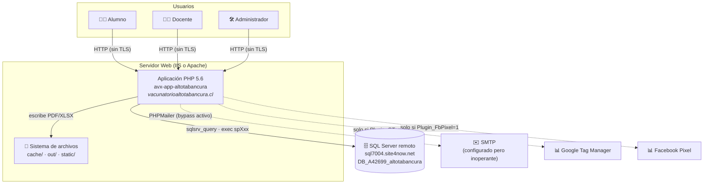
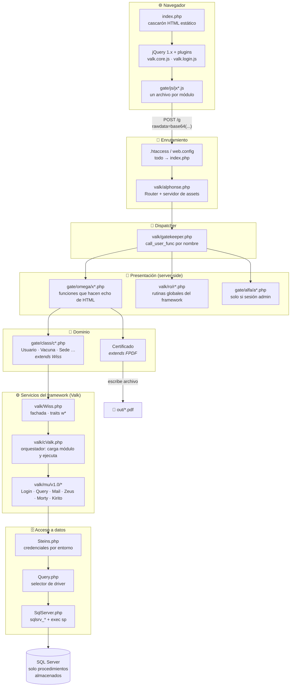
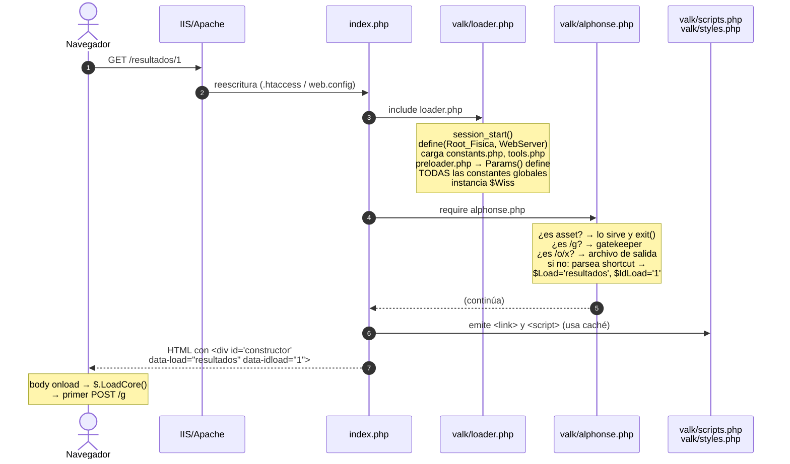
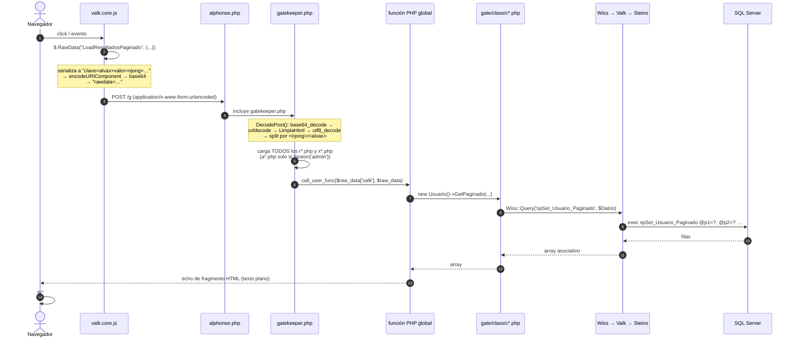
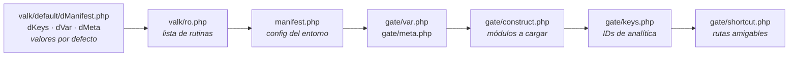

# 01 · Arquitectura de solución

## 1. Vista de contexto (C4 nivel 1)

> ⚠️ Los plugins de analítica están **configurados con IDs reales** (`gate/keys.php`) pero
> los flags `Plugin_GTag` / `Plugin_FbPixel` valen `'0'` por defecto (`valk/default/dManifest.php`)
> y `manifest.php` no los sobrescribe → **no se cargan actualmente**. ✅ Verificado en `valk/snitch.php:2,14`.

## 2. Vista de capas (C4 nivel 2)

## 3. Decisiones arquitectónicas de fondo (y sus consecuencias)

| # | Decisión | Consecuencia positiva | Consecuencia negativa |
|---|---|---|---|
| DA-01 | **Un único endpoint HTTP** (`POST /g`) con dispatch por nombre de función | API mínima, cero configuración de rutas | Cualquier función global del proyecto es invocable por el cliente ⇒ superficie de ataque enorme (ver [SEC-01](08-seguridad.md)) |
| DA-02 | **El servidor devuelve fragmentos de HTML**, no JSON | Cliente trivial (`$(...).html(response)`), sin plantillas | Presentación y lógica mezcladas; imposible reutilizar la API; XSS por concatenación de strings |
| DA-03 | **Toda la lógica SQL en procedimientos almacenados** | Inmune a inyección SQL desde PHP (parámetros ligados en `SqlServer.php:27-30`); la BD es la fuente de verdad | La lógica de negocio es invisible en el repositorio; imposible versionar o revisar; ❓ no auditable sin acceso a la BD |
| DA-04 | **Framework propio (Valk) en lugar de uno estándar** | Control total, sin dependencias externas | Sin comunidad, sin parches de seguridad, sin documentación, imposible de contratar personal que lo conozca |
| DA-05 | **Sin gestor de dependencias** (librerías copiadas a `vendor/`) | Despliegue = copiar archivos | Versiones congeladas y desconocidas; no hay forma de aplicar parches de seguridad |
| DA-06 | **Concatenación de JS/CSS en caché generada en runtime** | Menos peticiones HTTP en producción | La app **escribe en su propio directorio** durante el request; caché invalidada solo manualmente |
| DA-07 | **Configuración por constantes PHP globales** (`Params()` + `define()`) | Acceso global sin inyección de dependencias | Estado global inmutable; imposible de testear; colisiones de nombres |
| DA-08 | **PDFs escritos a disco con nombre predecible y servidos por URL** | Descarga simple vía `<a href>` | Los PDFs con datos de salud quedan accesibles y enumerables (ver [SEC-03](08-seguridad.md)) |

## 4. Ciclo de vida de una petición

### 4.1 Carga inicial de la página (`GET /` o `GET /resultados/1`)

✅ Verificado en `index.php:1-30`, `valk/loader.php`, `valk/alphonse.php`.

> ⚠️ **Anomalía**: cuando `alphonse.php` no encuentra ruta ni asset, termina con
> `header("location:")` (cabecera `Location` **vacía**) en `valk/alphonse.php:172`.
> El header vacío es ignorado por los navegadores, por lo que el flujo continúa por accidente.

### 4.2 Cualquier interacción posterior (`POST /g`)

✅ Verificado en `valk/js/v1.0/valk.core.js:20-52`, `valk/gatekeeper.php`, `valk/tools/tEncode.php:85-98`.

> 🔍 **Nota sobre el "cifrado" del transporte**: `rawdata` **no está cifrado**, solo
> codificado en Base64 con un separador propietario. Es trivialmente legible y
> manipulable. Existe además una ruta alternativa cifrada con AES (`valk/gate.php`
> + `encrypt_decrypt()`), pero **no se usa**: el cliente siempre apunta a `/g`
> (`valk.core.js:5`), que resuelve a `gatekeeper.php`, no a `gate.php`.

## 5. Sistema de ruteo (Alphonse)

`valk/alphonse.php` es un router basado en expresiones regulares que resuelve, **en este orden**:

| Orden | Patrón de URL | Acción | Línea |
|---|---|---|---|
| 1 | `/test.php` | `include` directo del script de pruebas | `:28` |
| 2 | `/k/*.js`, `/k/*.css` | sirve desde `cache/` con `max-age=31536000` | `:32` |
| 3 | `/res/*.{png,jpg,svg,ico,gif,…}` | sirve recurso estático | `:37` |
| 4 | `/fonts/*` | ⚠️ regex incompleta (`(PENDIENTE)`), nunca coincide | `:43` |
| 5 | `/valk/{js,css}/*` | assets del framework (modo desarrollo) | `:48` |
| 6 | `/vendor/*.{js,css}` | assets de terceros | `:53` |
| 7 | `/gate/{js,css}/*` | assets de la app (modo desarrollo) | `:58` |
| 8 | `/static/*.{img}` | archivos subidos por usuarios | `:63` |
| 9 | `/o/<nombre>` | archivo generado en `out/` (PDF, XLSX) | `:68` |
| 10 | `/e/<payload-cifrado>` | endpoint de retorno OAuth (`valk/endpoint.php`) | `:79` |
| 11 | `/g` | **dispatcher** (`valk/gatekeeper.php`) | `:87` |
| 12 | `/u/*` | uploads — ⚠️ **bloque vacío, no implementado** | `:93` |
| 13 | cualquier otra | interpreta como *shortcut*: `/<vista>/<id>` | `:157-170` |

**Shortcuts registrados** (`gate/shortcut.php`): `dashboard`, `resultados`, `alumnos`,
`universidades`, `carreras`. Por defecto: `dashboard/1` (`gate/var.php:18-21`).

> ⚠️ El bucle que parsea shortcuts tiene un `break` incondicional al final de la primera
> iteración (`valk/alphonse.php:166`), por lo que **solo se evalúa el primer segmento** de la URL.

## 6. Sistema de configuración

La configuración se aplana a **constantes globales PHP** mediante `Params()`
(`valk/tools/tCore.php:8-21`), que recorre los arrays anidados y hace `define()`
concatenando las claves con `_`. Ejemplo: `$Manifest['Entorno']['Developer']` → constante `Entorno_Developer`.

**Orden de carga** (`valk/preloader.php`) — lo posterior **no** sobreescribe lo anterior,
porque `define()` ignora redefiniciones:

> ⚠️ **Trampa crítica de este diseño**: `Params($Manifest)` se ejecuta en `loader.php:22`
> **después** de cargar el preloader, y `define()` es de una sola vez. Como
> `valk/default/dKeys.php` ya define `Keys['OpenSSL']['Key']`, el archivo
> `valk/keys.php` (que contiene las mismas claves) **queda huérfano y sin efecto**.
> Las claves criptográficas efectivas son las del archivo *default*, versionadas en Git.

**Configuración efectiva en producción** (`manifest.php`):

| Constante | Valor | Efecto |
|---|---|---|
| `Gate` | `appcertificados` | prefijo de todas las claves de `$_SESSION` |
| `Root` / `Steins` | `http://vacunatorioaltotabancura.cl/` | URL base (⚠️ HTTP plano) |
| `Entorno_Developer` | `0` | usa JS/CSS concatenado de `cache/`; oculta banner de dev |
| `Entorno_DBServer` | `PRO` | credenciales de producción en `Steins.php` |
| `Entorno_Error` | `0` | `display_errors=0`, `error_reporting(0)` |
| `Entorno_BypassCorreo` | `1` | declarada pero **nunca leída** (el bypass real está hardcodeado) |
| `Version_Valk` | `1.0` | selecciona el directorio `valk/mu/v1.0/` |
| `Modulo_Facebook/Google/Jodit` | `0` | módulos desactivados |

## 7. Estrategia de caché de assets

En producción (`Entorno_Developer = 0`) la aplicación **genera archivos concatenados**
la primera vez que se solicita una página:

| Archivo generado | Contenido | Generado por |
|---|---|---|
| `cache/jv1.0.php` | lista de etiquetas `<script>` del framework | `valk/scripts.php:2-20` |
| `cache/jv1.0.js` | JS del framework concatenado y minimizado | `valk/mu/v1.0/Scripts.php` |
| `cache/jx1.0.js` | todos los `gate/js/jx*.js` concatenados | `valk/scripts.php:47-66` |
| `cache/ja1.0.js` | todos los `gate/js/ja*.js` (vacío: no existen) | `valk/scripts.php:68-87` |
| `cache/sv1.0.php` / `.css` | CSS del framework | `valk/styles.php` |
| `cache/sx1.0.css` | todos los `gate/css/sx*.css` | `valk/styles.php:47-70` |

**Invalidación**: solo por borrado manual del directorio, vía la función `CleanCache`
(`valk/ro/rDebug.php:13-22` y `valk/mu/v1.0/Kirito.php:19-27`), que es invocable
**por cualquiera** desde `/g` (ver [SEC-01](08-seguridad.md)).

⚠️ Consecuencia operativa: **cualquier cambio en JS o CSS requiere borrar `cache/` a mano**,
o subir la versión en `manifest.php` (`$Manifest['Version']['Js']`).
