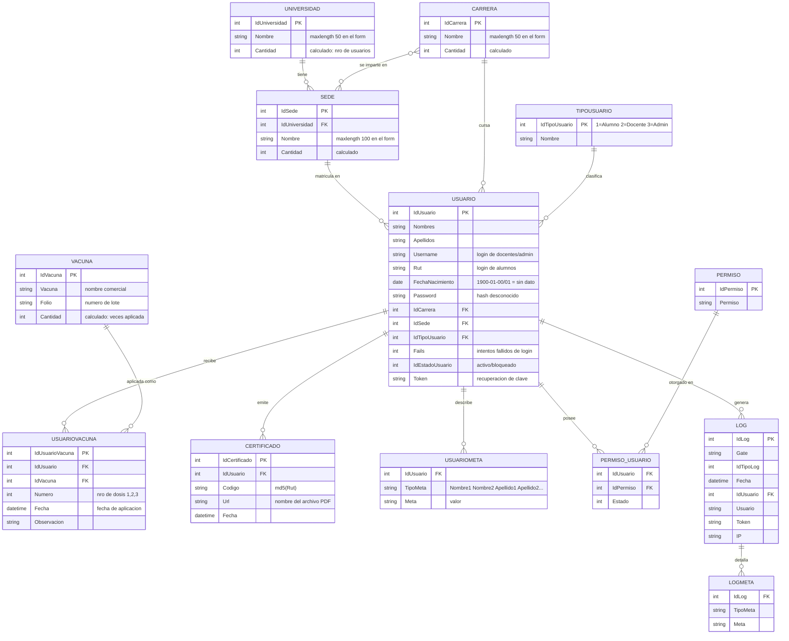
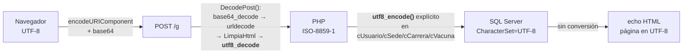

# 03 · Modelo de datos

> ⚠️ **Aviso de confianza.** La base de datos **no está versionada en este repositorio**:
> no hay `.sql`, ni migraciones, ni scripts DDL. Todo lo que sigue está **reconstruido**
> a partir de (a) los nombres y parámetros de los procedimientos almacenados invocados
> desde PHP y (b) las columnas efectivamente leídas del *result set*.
> Los tipos de dato, claves, índices, restricciones y valores por defecto son ❓ **desconocidos**.

**Base de datos:** `DB_A42699_altotabancura` (SQL Server) — `valk/mu/v1.0/Steins.php:11`

## 1. Diagrama entidad-relación (reconstruido)



### Notas sobre relaciones inciertas

| Relación | Duda | Evidencia |
|---|---|---|
| `CARRERA ↔ SEDE` | ¿Es una relación N:M explícita o se deriva de los alumnos? | Existen `spSel_CarreraBySede` y `spSel_SedeByCarrera` (`cCarrera.php:18`, `cSede.php:22`) que además reciben `IdUsuario` como parámetro — sugiere que la relación se **calcula desde la tabla de alumnos**, no de una tabla puente. 🔍 |
| `CARRERA ↔ UNIVERSIDAD` | `spSel_Carrera` recibe `IdUniversidad` (`cCarrera.php:6`), pero `spIns_Carrera` **no lo recibe** (`cCarrera.php:22`) | La carrera parece ser un catálogo **global**, filtrable por universidad a través de los alumnos. 🔍 |
| `USUARIO → IdUniversidad` | El login devuelve `IdUniversidad` (`rLogin.php:72`) aunque `Usuario` solo guarda `IdSede` | Se deduce por `join` con `SEDE` dentro del procedimiento. 🔍 |
| `USUARIOMETA` | Tabla clave-valor para atributos de usuario (`Nombre1`, `Apellido1`, …) | Usada solo por `Login::DatosUsuario` (`valk/mu/v1.0/Login.php:34-47`) y `Login::ModificarUsuario`, del **framework**, no del gate. Puede pertenecer a un esquema compartido entre proyectos Valk. 🔍 |

## 2. Catálogo de procedimientos almacenados

### 2.1 Del dominio (invocados desde `gate/class/`) — ✅ verificados

| Procedimiento | Parámetros de entrada | Invocado desde | Devuelve |
|---|---|---|---|
| `spSel_Usuario` | `Busqueda`, `Filtros` (XML), `IdUsuario` | `cUsuario.php:15` | listado de alumnos (sin paginar) |
| `spSel_Usuario_Paginado` | `IdUsuario`, `Busqueda`, `IdUniversidad`, `IdSede`, `IdCarrera`, `FechaVacunaDesde`, `FechaVacunaHasta`, `NumeroPagina`, `TamanoPagina`, `OrderBy` | `cUsuario.php:33` | página de alumnos |
| `spSel_Usuario_Total` | mismos filtros, sin paginación | `cUsuario.php:59` | conteo total (para paginador) |
| `spSel_Usuario_Certificado` | `IdUsuario` | `cUsuario.php:69` | ficha del alumno para el PDF |
| `spSel_Usuario_CertificadoTabla` | `IdUsuario` | `cUsuario.php:84` | filas para el PDF consolidado tipo tabla |
| `spSel_Usuario_Rut` | `Rut` | `cUsuario.php:74` | alumno por RUT |
| `spSel_Usuario_Vacunas` | `IdUsuario` | `cUsuario.php:105` | dosis del alumno (`Vacuna`, `Lote`, `Dosis`, `Fecha`, `Observacion`) |
| `spSel_Docente` | — | `cUsuario.php:64` | listado de docentes |
| `spIns_Usuario` | `IdUsuario`, `Nombres`, `Apellidos`, `Username`, `Rut`, `FechaNacimiento`, `IdCarrera`, `IdSede`, `Password`, `IdTipoUsuario` | `cUsuario.php:118` | **upsert** (crea si `IdUsuario=0`) |
| `spDel_Usuario` | `IdUsuario` | `cUsuario.php:123` | ❓ borrado físico o lógico |
| `spIns_Certificado` | `Codigo`, `IdUsuario`, `Url` | `cUsuario.php:95` | registra emisión |
| `spSel_Vacuna` | — | `cVacuna.php:9` | catálogo de vacunas + `Cantidad` |
| `spIns_Vacuna` | `IdVacuna`, `Vacuna`, `Lote` | `cVacuna.php:14` | upsert de vacuna |
| `spDel_Vacuna` | `IdVacuna` | `cVacuna.php:20` | elimina vacuna |
| `spIns_UsuarioVacuna` | `IdUsuarioVacuna`, `IdVacuna`, `IdUsuario`, `Numero`, `Fecha` | `cVacuna.php:39` | upsert de dosis aplicada |
| `spDel_UsuarioVacuna` | `IdUsuarioVacuna` | `cVacuna.php:44` | desasocia dosis |
| `spSel_VacunaUltima` | `IdUsuario` | `cVacuna.php:54` | última dosis registrada (para el formulario) |
| `spSel_Universidad` | `IdUniversidad` (opcional) | `cUniversidad.php:6,11` | universidades + `Cantidad` |
| `spSel_UniversidadSedes` | — | `cUniversidad.php:16` | universidades con sus sedes |
| `spIns_Universidad` | `IdUniversidad`, `Nombre` | `cUniversidad.php:21` | upsert |
| `spDel_Universidad` | `IdUniversidad` | `cUniversidad.php:26` | elimina |
| `spSel_Sede` | `IdUniversidad` (opcional) | `cSede.php:6,11` | sedes + `Universidad` + `Cantidad` |
| `spSel_SedeByUniversidad` | — | `cSede.php:17` | sedes agrupadas por universidad |
| `spSel_SedeByCarrera` | `IdCarrera`, `IdUsuario` | `cSede.php:22` | sedes que imparten la carrera |
| `spIns_Sede` | `IdSede`, `IdUniversidad`, `Nombre` | `cSede.php:29` | upsert |
| `spDel_Sede` | `IdSede` | `cSede.php:34` | elimina |
| `spSel_Carrera` | `IdUniversidad` (opcional) | `cCarrera.php:6,11` | carreras + `Cantidad` |
| `spSel_CarreraBySede` | `IdSede`, `IdUsuario` | `cCarrera.php:16` | carreras de una sede |
| `spIns_Carrera` | `IdCarrera`, `Nombre` | `cCarrera.php:22` | upsert |
| `spDel_Carrera` | `IdCarrera` | `cCarrera.php:27` | elimina |

### 2.2 De plataforma (invocados desde `valk/mu/v1.0/`)

| Procedimiento | Parámetros | Módulo | Estado de uso |
|---|---|---|---|
| `spRec_Usuario_Autentificar` | `Usuario`, `Clave` | `Login.php:21` | ✅ **en uso** (login) |
| `spRec_Permiso_Permiso` | `IdUsuario`, `Gate` | `Zeus.php:25` | ✅ en uso tras el login |
| `spRec_Usuario_Datos` | `IdUsuario` | `Login.php:34` | ⚠️ solo por `RecoverPass` (flujo roto) |
| `spRec_Usuario_ValidarToken` | `Token` | `Login.php:56` | ⚠️ flujo de recuperación |
| `spRec_Usuario_Recuperar` | `Usuario` | `Login.php:62` | ⚠️ flujo de recuperación |
| `spMod_Usuario_Clave` | `IdUsuario`, `Usuario`, `Pass`, `NewPass` | `Login.php:49` | ⚠️ flujo de recuperación |
| `spRec_Usuario_MultiCuenta` | `Usuario`, `IdOrigen`, `Clave` | `Login.php:28` | ❌ solo login social (desactivado) |
| `spMod_Usuario_Usuario` | `IdUsuario`, `Base` (XML) | `Login.php:77` | ❌ solo login social |
| `spRec_Usuario_Buscador` | `Busqueda` | `Login.php:87` | ❌ sin invocación desde el gate |
| `spRec_Usuario_Ultimos` | — | `Login.php:69` | ❌ sin invocación |
| `spIns_Log_Log` | `TipoLog`, `IP`, `Gate`, `IdUsuario`, `Usuario`, `Datos` (XML) | `Morty.php:31` | ❌ **auditoría muerta**: nada invoca a Morty |
| `spRec_Log_Log`, `spRec_Log_Meta` | filtros de búsqueda de log | `Morty.php:42,52` | ❌ sin invocación |
| `spRec_Usuario_Contactos`, `spRec_Chat_Chat`, `spIns_Chat_Chat` | chat | `Chat.php` | ❌ sin UI |
| `spRec_Neodoc_*`, `spIns_Recurso_Neodoc`, `spDel_Recurso_Neodoc`, `spRec_Actividad_Favorito` | gestor documental | `cNeodoc.php` | ❌ **de otro producto**, clase no cargada |

## 3. Cómo PHP llama a los procedimientos

✅ Verificado en `valk/mu/v1.0/SqlServer.php:26-41`:

```php
// Construye:  exec <Procedure> @Clave1= ? ,@Clave2= ?
foreach($this->Variables as $Key => $Value){
    $Vars .= '@' . $Key . '= ? ,';
    $Params[] = $Value;
}
$Stmt = sqlsrv_query($Conexion, ' exec '.$this->Procedure.' '.$Vars.' ', $Params, $Options);
```

**Implicaciones importantes:**

1. ✅ **Los valores van como parámetros ligados** ⇒ no hay inyección SQL por los *valores*.
2. ⚠️ **El nombre del procedimiento y los nombres de parámetro se concatenan sin escapar.**
   Hoy son literales del código fuente (seguro), pero un cambio que permita elegir el
   procedimiento desde la petición abriría inyección SQL inmediata. Ver [SEC-08](08-seguridad.md).
3. ⚠️ **Una conexión nueva por consulta**, sin *pooling* ni reintentos (`sqlsrv_connect` → `sqlsrv_close` en cada llamada).
4. ⚠️ **Los errores de BD se devuelven como HTML** (`SQLSTATE: … code: … message: …`, `SqlServer.php:47-49`)
   y terminan renderizados en la página del usuario. Fuga de información interna.
5. ⚠️ **Sin transacciones.** La secuencia "guardar alumno + guardar N vacunas" son N+1
   llamadas independientes desde el navegador (`jxUsuario.js` → `$.SaveUsuario` → `$.SaveVaccines`);
   un fallo parcial deja datos inconsistentes.
6. 🔍 Las columnas `datetime` llegan como **objetos `DateTime` de PHP**, no como string —
   el código hace `$V['Fecha']->format('Y-m-d')` (`gate/omega/xVacuna.php:118`). Un valor
   `NULL` en esa columna produce un *fatal error* (llamada a método sobre `null`).

## 4. Codificación de caracteres

Cadena de conversiones aplicada a los datos (⚠️ frágil e inconsistente):



- ✅ La conexión declara `'CharacterSet' => 'UTF-8'` (`SqlServer.php:32`).
- ⚠️ `DecodePost()` aplica `utf8_decode()` a **toda** entrada (`tEncode.php:87`), convirtiendo a Latin-1.
- ⚠️ Los modelos vuelven a aplicar `utf8_encode()` solo en **algunos** campos
  (`Nombre`, `Nombres`, `Apellidos`, `Username`, `Codigo`, `Url`) — pero **no** en `Rut`,
  `Password`, ni en los parámetros de búsqueda de `GetPaginado`.
- ⚠️ En la salida, `FPDF` requiere Latin-1, por eso todo el PDF usa `utf8_decode()`
  (`cCertificado.php`), salvo `UsuariosTabla()` que usa `utf8_encode()` sobre una
  fecha ya formateada (`cCertificado.php:158-163`) — inconsistencia.
- **Resultado esperable**: caracteres como `ñ`, `á`, `ü` se corrompen en ciertos caminos.
  Ver [`09-mejoras-deuda-tecnica.md`](09-mejoras-deuda-tecnica.md) MEJ-09.

## 5. Paso de filtros complejos vía XML

Para los filtros multi-valor, PHP serializa un array a XML con `ArrayToXml()`
(`valk/tools/tFormato.php:141-172`) y lo pasa como un solo parámetro `@Filtros`:

```php
// gate/omega/xUsuario.php:176
$Filtros = json_decode($data['filtros'], 1);           // JSON del cliente
$Busqueda = $Usuario->Get($data['busqueda'], ArrayToXml($Filtros));  // → XML al SP
```

Formato producido: `<data><row><idtipo>1</idtipo><valor>5</valor></row>…</data>`
donde `idtipo`: `1`=universidad, `2`=sede, `3`=carrera (`gate/omega/xUniversidad.php:31`,
`xSede.php:10`, `xCarrera.php:9`).

🔍 El procedimiento almacenado debe hacer *shredding* del XML (`OPENXML` o `.nodes()`).
⚠️ `ArrayToXml()` **no escapa** los valores: `$Xml->addChild($key, $value)` con un valor
que contenga `&` o `<` produce XML inválido o inyección de nodos.
