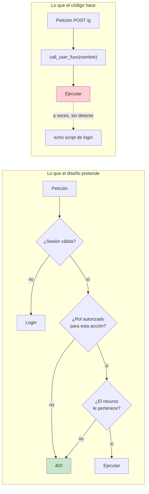

# 04 · Roles, sesiones y control de acceso

## 1. Los tres roles

| `IdTipoUsuario` | Perfil en sesión | Nombre | Se autentica con | Vista de entrada |
|---|---|---|---|---|
| `1` | `alumno` | Alumno / estudiante | **RUT** (usuario) + primeros 4 dígitos del RUT (clave) | `VistaAlumno` |
| `2` | `docente` | Docente / contraparte de la universidad | `Username` + contraseña asignada por el admin | `VistaDocente` |
| `3` | `admin` | Administrador (personal de la clínica) | `Username` + contraseña | `VistaAdmin` |

✅ Verificado: el mapeo `IdTipoUsuario → perfil` está en `valk/ro/rLogin.php:77-89`;
la ramificación por perfil, en `gate/omega/xCore.php:41-56`.

## 2. Matriz de capacidades **según la interfaz**

> ⚠️ Esta matriz describe lo que la **UI ofrece**. **No** es lo que el sistema *impide*:
> ver §5 y [SEC-01](08-seguridad.md) — en la práctica casi todo es accesible por cualquiera.

| Capacidad | Alumno | Docente | Admin | Sin sesión |
|---|:---:|:---:|:---:|:---:|
| Ver sus propios datos y vacunas | ✅ | — | — | ❌ |
| Descargar su propio certificado PDF | ✅ | — | — | ❌ |
| Buscar alumnos por nombre/RUT | ❌ | ✅ *(de su universidad)* | ✅ *(todas)* | ❌ |
| Filtrar por universidad | ❌ | ❌ *(fijada a la suya)* | ✅ | ❌ |
| Filtrar por sede / carrera / rango de fechas | ❌ | ✅ | ✅ | ❌ |
| Ver columna "Universidad" y "Vacunas" en la grilla | ❌ | ❌ | ✅ | ❌ |
| Descargar certificados de terceros (individual/lote/tabla) | ❌ | ✅ | ✅ | ❌ |
| Crear / editar / eliminar **alumnos** | ❌ | ❌ | ✅ | ❌ |
| Crear / editar / eliminar **docentes** | ❌ | ❌ | ✅ | ❌ |
| Asignar / editar / quitar **vacunas** a un alumno | ❌ | ❌ | ✅ | ❌ |
| ABM de **universidades, sedes, carreras, vacunas** | ❌ | ❌ | ✅ | ❌ |
| Acceder al panel "Administración" (barra lateral) | ❌ | ❌ | ✅ | ❌ |
| Ver la portada / formulario de login | ✅ | ✅ | ✅ | ✅ |

## 3. Modelo de sesión

Todas las claves de `$_SESSION` van prefijadas por la constante `Gate` (aquí `appcertificados`),
lo que permite alojar varias apps Valk en el mismo dominio sin colisión.
✅ `valk/tools/tSesion.php:28-46`.

| Clave (`appcertificados_…`) | Contenido | Escrita en |
|---|---|---|
| `idusuario` | `IdUsuario` autenticado | `rLogin.php:75` |
| `usuario` | `Username` (o RUT) | `rLogin.php:76,90` |
| `perfil` | `'alumno'` \| `'docente'` \| `'admin'` | `rLogin.php:78-88` |
| `universidad` | `IdUniversidad` del usuario (acota al docente) | `rLogin.php:91` |
| `admin` | flag de permiso avanzado — ⚠️ ver §4 | `rLogin.php:101` |
| `temp_idusuario`, `temp_usuario`, `temp_token` | estado transitorio del flujo de recuperación de contraseña | `rLogin.php:260-262` |
| `Cache` | memoria por sesión de datos de usuario y permisos | `tSesion.php:47-56` |

### Funciones de sesión

```php
Sesion($nombre)        // lee, devuelve el string '0' si no existe
SetSesion($n, $v)      // escribe; con $v = null ⇒ ELIMINA la clave
ValidaSesion()         // ¿idusuario != '0'?
ValidaAdmin()          // ¿admin != '0'?
FiltrarSesion()        // si no hay sesión: echo '<script>$.LoadMidBlock(1);</script>'
RemoveSesion()         // session_destroy() + script de recarga
CleanSesionCache()     // limpia la caché en sesión (se ejecuta en cada carga de index.php)
```

> ⚠️ **`Sesion()` devuelve el string `'0'`, no `null` ni `false`.** Toda comparación
> debe hacerse contra `'0'`. Un `IdUsuario` real igual a `0` sería indistinguible de "sin sesión".

## 4. Los dos mecanismos de "admin" (y por qué uno está roto)

El sistema tiene **dos** nociones de administrador que **no coinciden**:

```mermaid
graph TB
    subgraph "Mecanismo A — el que SÍ funciona"
        A1["Login: IdTipoUsuario = 3"] --> A2["SetSesion('perfil', 'admin')"]
        A2 --> A3["EsAdmin() → Sesion('perfil') == 'admin'"]
        A3 --> A4["✅ Controla lo que se RENDERIZA<br/>(gate/omega/xCore.php:130)"]
    end

    subgraph "Mecanismo B — el que está ROTO"
        B1["Login: Wiss->PermisosUsuario(IdUsuario)"] --> B2["Zeus → spRec_Permiso_Permiso"]
        B2 --> B3["wZeus indexa el array<br/>POR IdPermiso:<br/>$R[$per['IdPermiso']] = [...]"]
        B3 --> B4["rLogin.php:97 lee $Permisos<b>[0]</b>['Estado']"]
        B4 --> B5["❌ El índice 0 no existe<br/>salvo que exista un IdPermiso = 0"]
        B5 --> B6["SetSesion('admin', …) casi nunca se ejecuta"]
        B6 --> B7["⇒ gate/alfa/a*.php nunca se carga<br/>⇒ ValidaAdmin() / FiltroAdmin() inútiles"]
    end
```



✅ Verificado: `valk/commands/wZeus.php:14-19` indexa por `IdPermiso`;
`valk/ro/rLogin.php:98-102` lee el índice `[0]`.

**Consecuencia práctica:** el sistema de permisos granulares del framework (tabla `PERMISO`)
está efectivamente **desconectado**. El único control real es `Sesion('perfil') == 'admin'`,
y ese control **solo decide qué HTML se dibuja**, no qué operaciones se permiten.

Como `gate/alfa/aUsuario.php` está vacío (solo un comentario de PhpStorm), la capa
`alfa` no aporta nada hoy — pero es el mecanismo previsto para código solo-admin.

## 5. ⚠️ Dónde se aplican (y dónde NO) los controles de acceso

Auditoría exhaustiva de todas las funciones invocables desde `/g`:

| Función invocable | ¿Verifica sesión? | ¿Verifica rol? | Riesgo |
|---|:---:|:---:|---|
| `VistaAlumno`, `VistaDocente`, `VistaAdmin`, `EstructuraBase` | `FiltrarSesion()` | ❌ | 🟠 `FiltrarSesion` **no detiene la ejecución** (ver abajo) |
| `LoadMidBlock` | ✅ (decide `$Init`) | ✅ (rama por perfil) | 🟢 |
| `LoadSidebar`, `LoadResultados`, `LoadResultadosPaginado`, `LoadPaginacion` | ❌ | parcial (`EsAdmin` solo elige columnas) | 🔴 datos de terceros sin sesión |
| `LoadUsuario`, `LoadDocente`, `LoadDocenteAdmin` | ❌ | ❌ | 🔴 lectura de ficha completa de cualquier persona |
| `CreateModifyUsuario`, `RemoveUsuario` | ❌ | ❌ | 🔴 **alta/edición/borrado de usuarios sin autenticación** |
| `CreateModifyVacuna`, `RemoveVacuna`, `UserVaccine`, `DetachVaccine`, `AddVaccine` | ❌ | ❌ | 🔴 alteración de registros clínicos |
| `CreateModify{Universidad,Sede,Carrera}`, `Remove{…}` | ❌ | ❌ | 🔴 borrado de catálogos |
| `GenerarCertificado`, `GenerarCertificadoTabla` | ❌ | ❌ | 🔴 emisión de certificados de cualquier `IdUsuario` |
| `LoadAdmin`, `LoadAlumnoForm`, `LoadDocenteForm`, `Load*Form`, `Load*Admin` | ❌ | ❌ | 🟠 exposición de la UI de administración |
| `LoadSelect*` (universidades, sedes, carreras, vacunas) | ❌ | ❌ | 🟠 enumeración de catálogos |
| `Autentificar`, `LoadLogin`, `LoadPortada` | n/a (público) | n/a | 🟢 |
| `IniciarSesion` | ❌ | ❌ | 🔴 **permite fijar la sesión con cualquier `IdUsuario`** |
| `DatosSesion` (rDebug) | ❌ | ❌ | 🔴 vuelca `$_SESSION`, `$_COOKIE` y el manifiesto |
| `CleanCache` | ❌ | ❌ | 🟠 borrado del caché (DoS leve) |
| `DeleteSesion`, `HeartBeat` | n/a | n/a | 🟢 |

### Por qué `FiltrarSesion()` no protege

```php
// valk/tools/tSesion.php:7-11
function FiltrarSesion(){
    if (! ValidaSesion()) {
        echo '<script>$.LoadMidBlock(1);</script>';   // ⚠️ NO hay return / die / exit
    }
}
```

Solo **emite un script** que pide al navegador volver a la pantalla de login.
La función que la llamó **sigue ejecutándose** y sigue consultando la base de datos
y emitiendo su HTML. Un cliente que ignore el `<script>` (curl, Postman) recibe
todos los datos igualmente. 🔴 Ver [SEC-01](08-seguridad.md).

## 6. Diagrama de control de acceso deseado vs. real



## 7. Recomendación mínima de remediación

Ver el plan completo en [`08-seguridad.md`](08-seguridad.md). En una línea:
**introducir una tabla de autorización explícita `función → roles permitidos` en
`gatekeeper.php`, evaluada antes del `call_user_func`, con denegación por defecto.**
