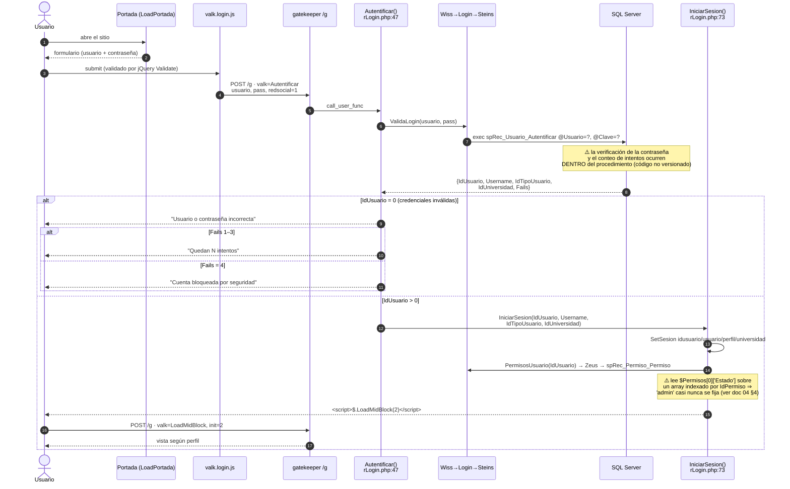
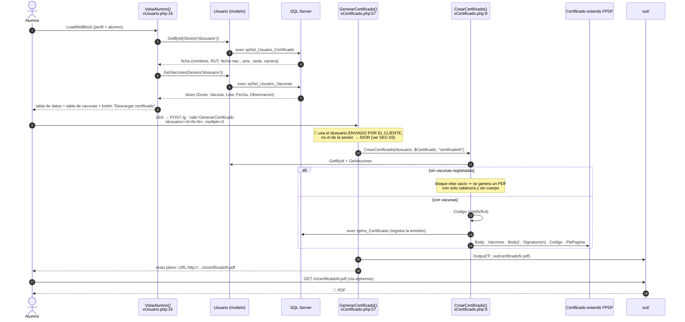
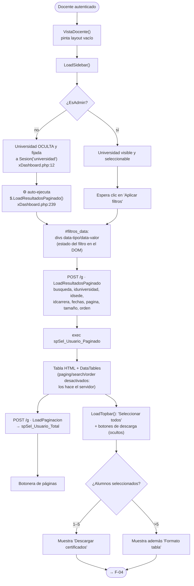
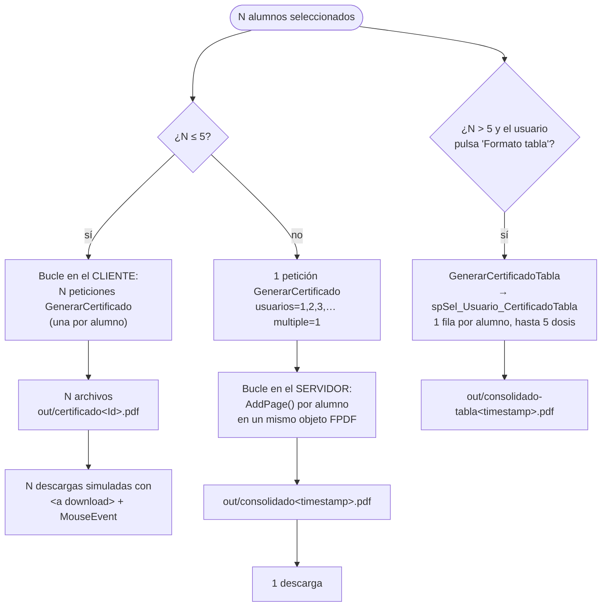
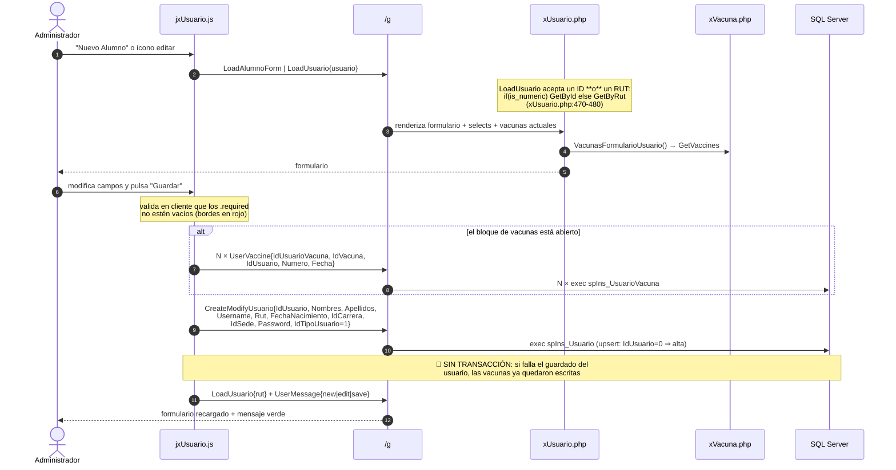
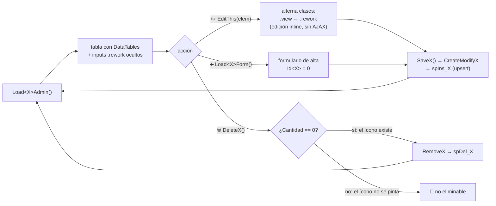
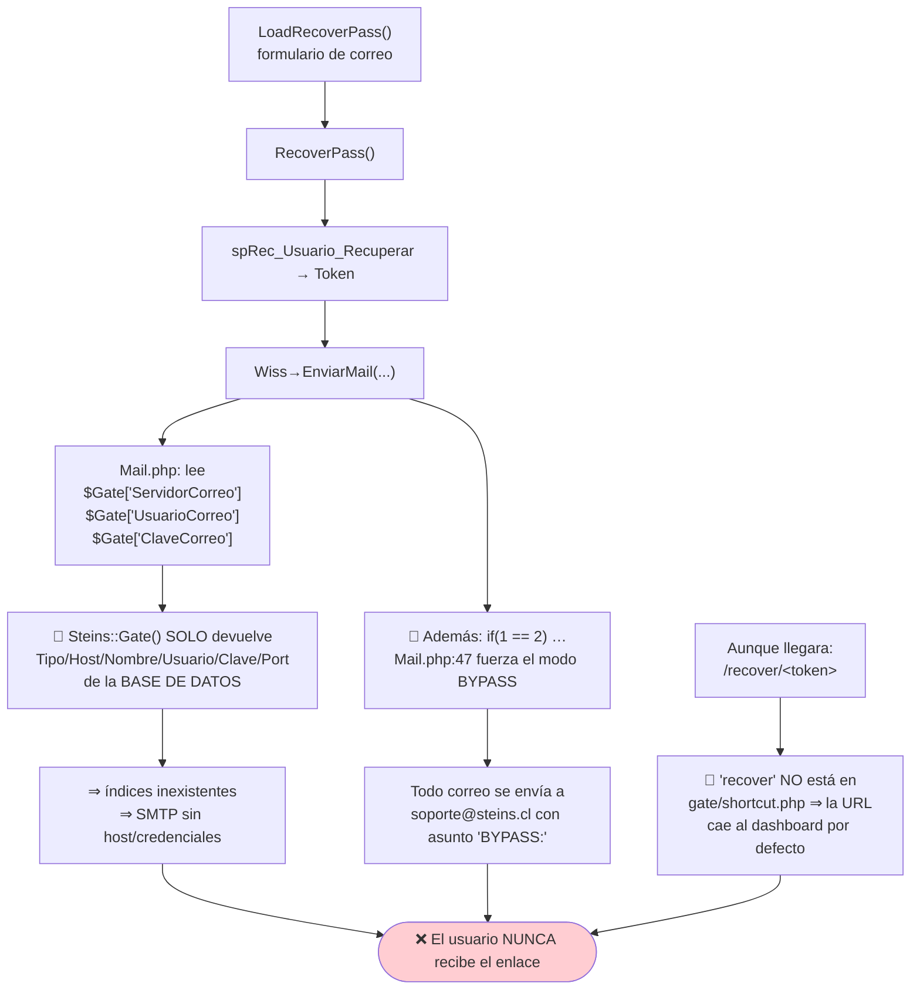

# 05 · Flujos funcionales (diagramas de flujo y secuencia)

Índice de flujos:

| ID | Flujo | Estado |
|---|---|---|
| [F-01](#f-01--autenticación-login) | Autenticación (login) | ✅ operativo |
| [F-02](#f-02--alumno-consulta-y-descarga-su-certificado) | Alumno: consulta y descarga de su certificado | ✅ operativo |
| [F-03](#f-03--docente-búsqueda-filtrada-de-alumnos) | Docente: búsqueda filtrada de alumnos | ✅ operativo |
| [F-04](#f-04--descarga-masiva-de-certificados) | Descarga masiva de certificados | ✅ operativo |
| [F-05](#f-05--administración-de-un-alumno-y-sus-vacunas) | Admin: alta/edición de alumno y sus vacunas | ✅ operativo |
| [F-06](#f-06--abm-de-catálogos) | Admin: ABM de catálogos | ✅ operativo |
| [F-07](#f-07--recuperación-de-contraseña-inoperante) | Recuperación de contraseña | ❌ **inoperante** |
| [F-08](#f-08--registro-de-usuario-deshabilitado) | Registro de usuario | ❌ deshabilitado |
| [F-09](#f-09--login-con-red-social-desactivado) | Login con red social | ❌ desactivado |
| [F-10](#f-10--heartbeat-de-sesión) | Heartbeat de sesión | ⚠️ parcial |

---

## F-01 · Autenticación (login)



**Puntos críticos del flujo:**

| # | Observación | Ubicación |
|---|---|---|
| 1 | La contraseña viaja en **Base64 sobre HTTP sin TLS** — equivalente a texto plano en la red | `valk.core.js:24-35`, `manifest.php:14` |
| 2 | El comentario `/* TODO: incluir validacion */` indica que la validación de entrada **nunca se implementó** | `rLogin.php:47` |
| 3 | El algoritmo de hash de contraseña es ❓ **desconocido** (vive en el SP). `RecoverPassPush` usa `md5()`, lo que sugiere MD5 sin sal | `rLogin.php:307` |
| 4 | El mensaje de bloqueo revela si la cuenta existe (enumeración de usuarios) | `rLogin.php:57-70` |
| 5 | El identificador de sesión PHP **no se regenera** tras autenticar ⇒ *session fixation* | `rLogin.php:74-103` |

---

## F-02 · Alumno: consulta y descarga su certificado



**Estructura del PDF generado** (`gate/class/cCertificado.php`):

```
┌──────────────────────────────────────────┐
│  [logo Alto Tabancura]                   │  Header()
│      Certificado de Vacunación           │
├──────────────────────────────────────────┤
│ Procedimientos Clínicos Alto Tabancura,  │  Body()
│ Rut 76.004.217-K, certifica que <NOMBRE>,│
│ Rut <RUT> fue inmunizado(a) con la(s)    │
│ siguiente(s) vacuna(s):                  │
├──────────────────────────────────────────┤
│ │ Vacuna │ Lote │ Dosis │ Fecha │        │  Vaccines()
│ │  ...   │ ...  │  ...  │  ...  │        │
├──────────────────────────────────────────┤
│ Se extiende el presente certificado…     │  Body2()
│                                          │
│           [firma escaneada]              │  Signature(nº vacunas)
│                                          │  ⚠️ posición Y calculada
│      Código de validación: <md5(RUT)>    │  Codigo()
│      Fecha de emisión: <hoy>             │
│  Av. Tabancura 1515, Vitacura… teléfonos │  PiePagina()
└──────────────────────────────────────────┘
```

⚠️ **Anomalías del PDF:**
- La firma es una **imagen escaneada** (`res/signature2.png`) posicionada en coordenadas
  fijas según la cantidad de vacunas (1→6+). Con >6 dosis la tabla puede solaparse con la firma.
- El logo y la firma se cargan por **URL HTTP absoluta** (`constant('Root_Base').…`,
  `cCertificado.php:14,62`) ⇒ **el servidor hace una petición HTTP a sí mismo** por cada PDF.
  Si el sitio está caído o `allow_url_fopen` deshabilitado, la generación falla.
- Existe un intérprete HTML propio (`WriteHTML`) que quedó **todo comentado**; el PDF es texto plano.

---

## F-03 · Docente: búsqueda filtrada de alumnos



**Interacción cruzada sede↔carrera:** al elegir una sede, el cliente recarga las
carreras de esa sede (`$.ResultadosPorSede` → `LoadSelectCarreraBySede`) y viceversa
(`$.ResultadosPorCarrera` → `LoadSelectSedeByCarrera`). ⚠️ Ambos usan un
`setTimeout(…, 500)` para recargar resultados en paralelo a la petición del filtro —
**condición de carrera**: si la BD tarda más de 500 ms, la tabla se pinta con el filtro anterior.
✅ `gate/js/jxUsuario.js` (`$.ResultadosPorSede`).

---

## F-04 · Descarga masiva de certificados



⚠️ **Problemas conocidos de este flujo:**
- `$.GenerarMultiplesCertificados` lanza hasta 5 AJAX **en paralelo sin esperar**;
  el indicador de carga se apaga inmediatamente (`jxCertificado.js`).
- Los nombres `certificado<IdUsuario>.pdf` son **fijos**: dos alumnos distintos nunca
  colisionan, pero un mismo alumno **sobrescribe** su PDF anterior; y como no hay
  limpieza, `out/` **crece indefinidamente** con datos de salud.
- El PDF consolidado usa `$fecha->getTimestamp()` (resolución de 1 segundo): dos
  peticiones en el mismo segundo se **pisan** entre sí.
- `UsuariosTabla()` lee `$Usuario[$i]['Fecha']->format(...)` sin verificar `null`
  (`cCertificado.php:158-163`) ⇒ *fatal error* si el SP devuelve fecha nula.

---

## F-05 · Administración de un alumno y sus vacunas



**Detalles de implementación relevantes:**
- Al crear un **alumno** desde la UI, el cliente envía `Username: ""` y `Password: ""`
  (`jxUsuario.js`, `$.SaveUsuario`) ⇒ 🔍 el procedimiento almacenado debe derivar
  las credenciales desde el RUT (coherente con la regla RN-01).
- Al crear un **docente**, `IdCarrera` va fijo en `37` ("Sin Carrera") y la contraseña
  se envía **en texto plano**; si el campo vale `'******'` se interpreta como "no cambiar"
  (`jxUsuario.js`, `$.SaveDocente`).
- `$.DeleteUsuario` y `$.DeleteDocente` llaman a `RemoveUsuario` **sin diálogo de
  confirmación**: un clic accidental en el ícono de papelera borra el registro.

---

## F-06 · ABM de catálogos

Universidades, sedes, carreras y vacunas comparten el mismo patrón:



⚠️ La regla "solo se elimina si `Cantidad == 0`" se aplica **únicamente ocultando el
ícono en el HTML** (`xUniversidad.php:76`, `xSede.php:151`, `xCarrera.php:83`, `xVacuna.php:45`).
La función `RemoveX` no la revalida ⇒ una petición directa a `/g` puede borrar un
catálogo en uso. ❓ A menos que el procedimiento almacenado lo impida (no verificable).

---

## F-07 · Recuperación de contraseña (INOPERANTE)



✅ Verificado: `valk/mu/v1.0/Mail.php:44` (`if(1 == 2)`), `Mail.php:16-18` vs
`valk/mu/v1.0/Steins.php:25-27`, `gate/shortcut.php` (sin `recover`),
`valk/ro/rLogin.php:12` (el enlace "Recuperar Contraseña" está **comentado** en el formulario).

**Impacto operativo:** un usuario que olvide su contraseña **no tiene forma autónoma
de recuperarla**. La única vía es que un administrador la reasigne. Además,
`RecoverPassPush` aplica `md5()` a la nueva contraseña (`rLogin.php:307`) mientras que
`Autentificar` envía la contraseña **sin hashear** (`rLogin.php:50`) —
un cambio de contraseña por esta vía dejaría al usuario **sin poder entrar**. 🔍

---

## F-08 · Registro de usuario (DESHABILITADO)

`LoadRegistro()` (`rLogin.php:107`) pinta un formulario completo con validaciones y
términos y condiciones, pero:
- el botón "Registrarse" del login está **comentado** (`rLogin.php:16`);
- la función servidor `Registrar()` (`rLogin.php:176-183`) **asigna variables locales y no hace nada más** — cuerpo sin implementar;
- el texto de términos y condiciones es un *placeholder* en inglés que menciona
  `[forum-name]` y Facebook Login (`valk/ro/rValk.php:3`).

⚠️ Aun así, `Registrar` y `LoadRegistro` **siguen siendo invocables** desde `/g`.

---

## F-09 · Login con red social (DESACTIVADO)

Infraestructura completa (SDK de Facebook, `RedSocial.php`, `valk/endpoint.php`,
ruta `/e/<payload-AES>`, procedimiento `spRec_Usuario_MultiCuenta`) pero:
- `Modulo_Facebook = 0` y `Modulo_Google = 0` (`manifest.php:28-30`);
- `$Var['Facebook']['Id']` y `['Secret']` están **vacíos** (`gate/var.php:43-46`);
- Google nunca se implementó (`$Link['Google'] = 'PENDIENTE'`, `RedSocial.php:54`);
- `vendor/Facebook/doorlock.php` está **corrupto** (bytes binarios desde la línea ~60);
- `vendor/Google/` no tiene `doorlock.php`, solo un `autoload.php.old`.

⇒ Si alguien activara estos flags, la aplicación **fallaría al cargar**.

---

## F-10 · Heartbeat de sesión

```mermaid
sequenceDiagram
    participant U as Navegador
    participant EB as EstructuraBase()
    participant HB as HeartBeat()<br/>rLogin.php:321

    EB-->>U: <script>$.HeartBeat();</script>
    U->>HB: POST /g · valk=HeartBeat, edward=0
    alt sesión inválida
        HB-->>U: RemoveSesion() → session_destroy()<br/>+ clearTimeout(HeartBeat) + $.LoadCore()
    else sesión válida
        HB-->>U: (respuesta vacía)
    end
    Note over U,HB: ⚠️ El bucle de reintento (setTimeout cada 5 s)<br/>está COMENTADO en valk.watchdog.js ⇒<br/>el heartbeat se ejecuta UNA SOLA VEZ
```

⚠️ Sin bucle activo, el heartbeat no detecta expiraciones posteriores de sesión:
el usuario descubre que su sesión murió solo cuando una acción devuelve el script de login.
