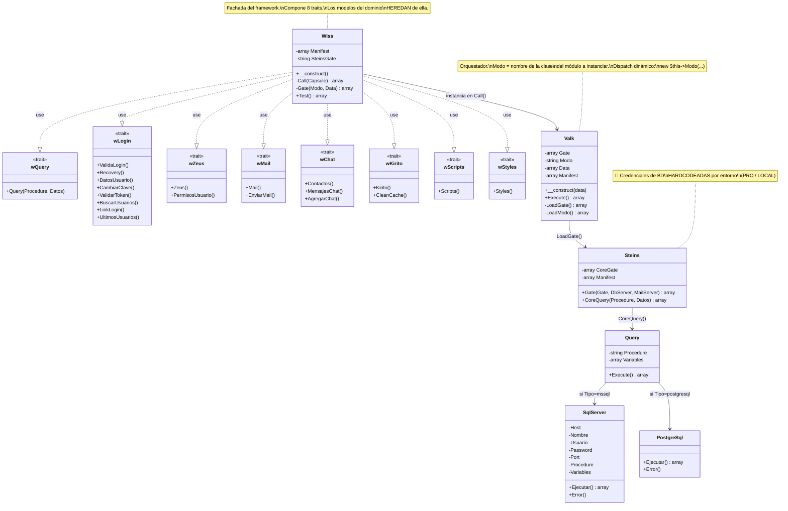
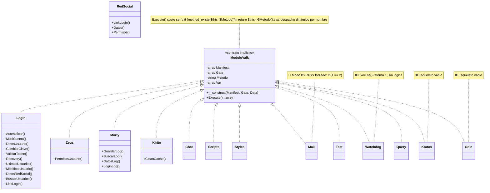
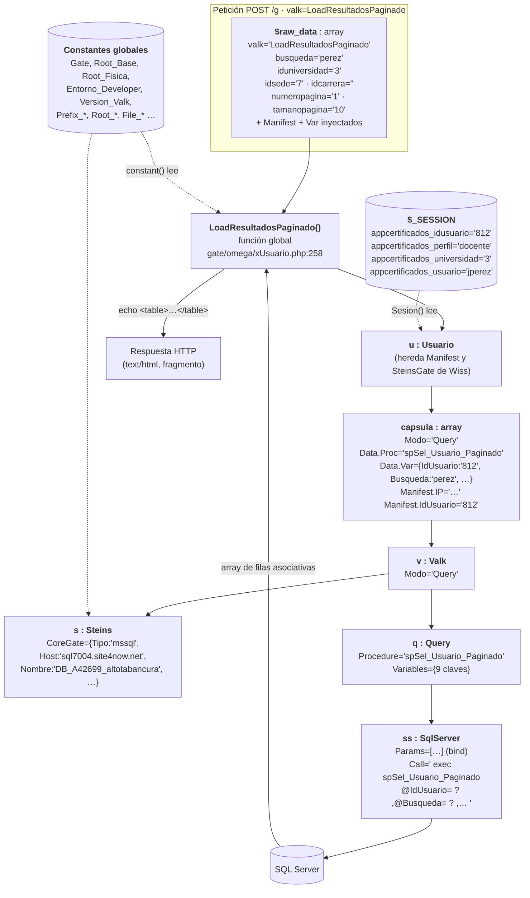
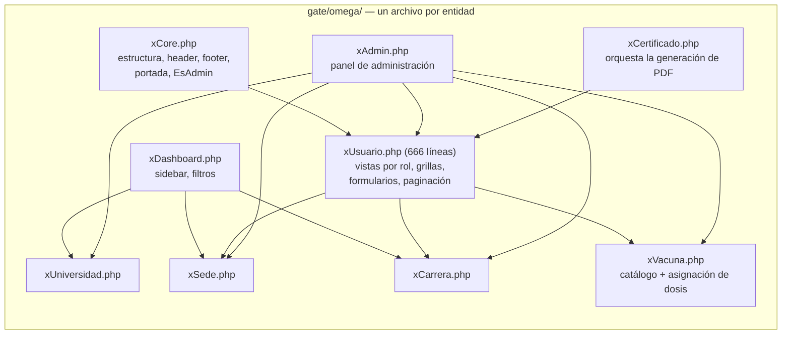
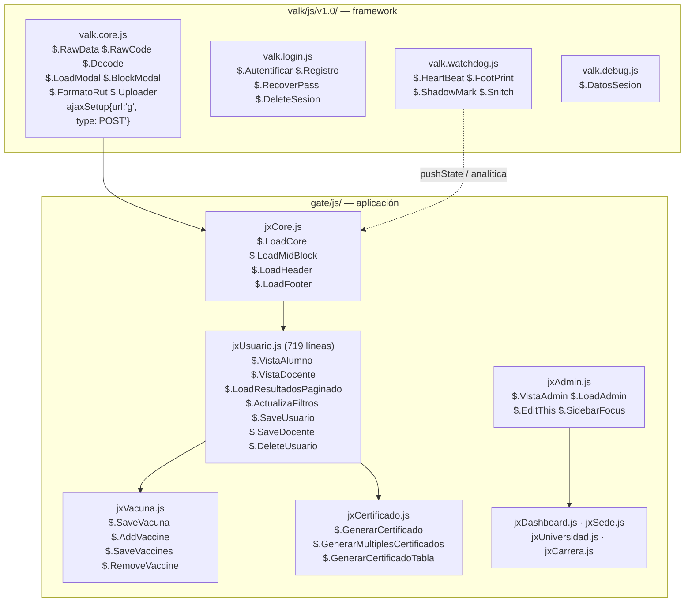

# 06 · Diagramas de clases y objetos

## 1. Panorama: dos jerarquías y un montón de funciones globales

El sistema **no es plenamente orientado a objetos**. Conviven tres estilos:

| Estilo | Dónde | Ejemplo |
|---|---|---|
| **Clases con herencia** | modelos del dominio y módulos del framework | `class Usuario extends Wiss` |
| **Traits como API** | comandos del framework | `trait wLogin { … }` compuesto en `Wiss` |
| **Funciones globales sueltas** | toda la capa de presentación y utilidades | `function LoadResultadosPaginado($data)` |

Esta última capa es la que el dispatcher invoca por nombre, y es la más grande del proyecto.

---

## 2. Diagrama de clases — núcleo del framework (Valk)

### Módulos de servicio (`valk/mu/v1.0/`) — interfaz implícita

Todos comparten el mismo contrato **por convención, sin `interface` declarada**:

> ⚠️ **Riesgo de diseño**: `Execute()` hace `$this->$Metodo()` donde `$Metodo` proviene
> del llamador. Está acotado a métodos privados de la propia clase (`method_exists`),
> pero convierte cada módulo en un mini-dispatcher. Ver [SEC-08](08-seguridad.md).

---

## 3. Diagrama de clases — dominio de la aplicación (gate)

```mermaid
classDiagram
    class Wiss {
        <<framework>>
    }

    class Usuario {
        +Get(Busqueda, Filtros)
        +GetPaginado(Busqueda, IdUni, IdSede, IdCarrera, FDesde, FHasta, Pag, Tam, Order)
        +GetPaginadoTotal(...)
        +GetDocentes()
        +GetById(IdUsuario)
        +GetByRut(Rut)
        +GetInfoCertificadoTabla(IdUsuario)
        +GetVaccines(IdUsuario)
        +IngresarCertificado(Codigo, IdUsuario, Url)
        +CreateModify(IdUsuario, Nombres, Apellidos, Username, Rut, FNac, IdCarrera, IdSede, Password, IdTipoUsuario)
        +Remove(IdUsuario)
    }
    class Vacuna {
        +Get(IdUniversidad)
        +GetAll()
        +CreateModify(IdVacuna, Vacuna, Lote)
        +Remove(IdVacuna)
        +UserVaccine(IdUsuarioVacuna, IdVacuna, IdUsuario, Numero, Fecha)
        +DetachVaccine(IdUsuarioVacuna)
        +GetLast(IdUsuario)
    }
    class Universidad {
        +Get(IdUniversidad)
        +GetAll()
        +GetAllWithSedes()
        +CreateModify(IdUniversidad, Nombre)
        +Remove(IdUniversidad)
    }
    class Sede {
        +Get(IdUniversidad)
        +GetAll()
        +GetAllByUniversidad()
        +GetByCarrera(IdCarrera)
        +CreateModify(IdSede, IdUniversidad, Nombre)
        +Remove(IdSede)
    }
    class Carrera {
        +Get(IdUniversidad)
        +GetAll()
        +GetBySede(IdSede)
        +CreateModify(IdCarrera, Nombre)
        +Remove(IdCarrera)
    }
    class Neodoc {
        <<código muerto>>
        +Get()
        +Save()
        +Delete()
        +Restore()
        +Star()
        +getFavoritos()
    }

    Wiss <|-- Usuario
    Wiss <|-- Vacuna
    Wiss <|-- Universidad
    Wiss <|-- Sede
    Wiss <|-- Carrera
    Wiss <|-- Neodoc

    class FPDF {
        <<vendor>>
    }
    class Certificado {
        #int B
        #int I
        #int U
        #string HREF
        +Header()
        +Body(Nombre, Rut, Carrera, Sede, Universidad)
        +Vaccines(header, data)
        +Body2()
        +Signature(nroVacunas)
        +Codigo(codigo)
        +PiePagina()
        +BodyTabla()
        +VaccinesTabla()
        +UsuariosTabla(Usuario)
        +PiePaginaTabla()
        +WriteHTML(html)
        +SetStyle()
        +OpenTag()
        +CloseTag()
        +PutLink()
    }
    FPDF <|-- Certificado
```

> ⚠️ **Anomalía de herencia**: `Usuario extends Wiss` y luego invoca sus métodos como
> **estáticos**: `Wiss::Query('spSel_Usuario', $Datos)` (`cUsuario.php:15`). Como
> `wQuery::Query` es un método de **instancia** que usa `$this`, PHP 5.6 lo tolera
> (contexto `$this` heredado) pero es **sintaxis inválida en PHP 7+ en contexto estático real**
> y una fuente segura de errores en cualquier migración.
>
> 🔍 Además, la herencia es semánticamente incorrecta: `Usuario` **no es un** `Wiss`;
> lo usa. Debería ser composición.

---

## 4. Diagrama de objetos — instancia típica en tiempo de ejecución

Momento capturado: un docente pulsa "Aplicar filtros".

**Observaciones sobre el ciclo de vida:**
- Se crea **un objeto `Valk`, uno `Steins`, uno `Query` y uno `SqlServer` por cada consulta**.
- Cada uno abre y cierra su propia conexión TCP a SQL Server ⇒ una vista con 6 selects
  abre 6 conexiones. **No hay pooling ni reutilización.**
- `Wiss::__construct()` vuelve a hacer `require` del preloader completo en cada instancia
  (`valk/Wiss.php:30`), y `encrypt_decrypt()` también (`tEncode.php:178`).
- El estado global (constantes + `$_SESSION`) es leído directamente desde cualquier capa,
  incluida la de datos ⇒ **imposible testear unitariamente**.

---

## 5. Capa de presentación: no hay clases, hay funciones

`gate/omega/x*.php` y `valk/ro/r*.php` definen **~85 funciones globales** que:
1. reciben un único parámetro `$data` (el array completo de la petición),
2. consultan modelos,
3. hacen `echo` de HTML concatenado con `.`,
4. no devuelven nada.

⚠️ **Acoplamiento por funciones globales**: `xDashboard.php` llama a `LoadSelectUniversidadAll()`
definida en `xUniversidad.php`, que llama a `$.ActualizaFiltros` del cliente…
La única razón por la que funciona es que `gatekeeper.php` incluye **todos** los archivos
`x*.php` en **cada** petición (`valk/gatekeeper.php:12-31`) — lo que también significa
que **cada petición carga y parsea los 9 controladores completos**.

---

## 6. Modelo del cliente (JavaScript)

No hay clases: todo se cuelga del objeto `$` de jQuery como funciones sueltas.

**El estado del cliente vive en el DOM**, no en variables:

| Estado | Dónde se guarda |
|---|---|
| Vista actual y su id | `
` |
| Filtros de búsqueda | `

…` |
| Selección de alumnos | `input[name='usuario']:checked` con `data-idusuario` |
| Modo edición de una fila | clases CSS `.view` / `.rework` alternadas |

🔍 Es un patrón deliberado (permite que el servidor regenere el HTML sin perder estado),
pero implica que **cualquier usuario puede alterar los filtros y los IDs desde las
herramientas de desarrollo** — lo que, sumado a la falta de autorización en el servidor,
es explotable (ver [SEC-03](08-seguridad.md)).
