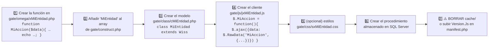

# 07 · Catálogo de endpoints y funciones invocables

## 1. Endpoints HTTP reales

| Método | Ruta | Maneja | Autenticación | Descripción |
|---|---|---|---|---|
| `GET` | `/` y `/<shortcut>[/<id>]` | `index.php` | ❌ pública | Cascarón HTML de la SPA |
| `POST` | `/g` | `valk/gatekeeper.php` | ❌ **ninguna** | **Dispatcher universal** (ver §2) |
| `GET` | `/k/<archivo>.{js,css}` | `alphonse.php` | ❌ | Assets concatenados de `cache/` |
| `GET` | `/res/…`, `/static/…`, `/valk/{js,css}/…`, `/vendor/….{js,css}`, `/gate/{js,css}/…` | `alphonse.php` | ❌ | Recursos estáticos |
| `GET` | `/o/<nombre>` | `alphonse.php` | ❌ **ninguna** | Archivo generado en `out/` (**PDF con datos de salud**) |
| `GET` | `/e/<payload-AES>` | `valk/endpoint.php` | n/a | Retorno OAuth (desactivado) |
| `POST` | `/valk/ro/rUploader.php` | `cUploadHandler.php` | ❌ **ninguna** | **Subida de archivos** (ver [SEC-02](08-seguridad.md)) |
| `GET` | `/test.php` | `test.php` | ❌ | Script de pruebas del desarrollador |
| `GET` | `/valk/test.php` | `valk/test.php` | ❌ | Script de pruebas del framework |
| `GET` | `/log.txt` | archivo estático | ❌ | **Log de aplicación en texto plano** |
| `POST` | `/valk/gate.php` | `valk/gate.php` | canal AES | Ruta alternativa cifrada — **sin cliente que la use** |

## 2. Protocolo del dispatcher `/g`

### Petición

```http
POST /g HTTP/1.1
Content-Type: application/x-www-form-urlencoded

rawdata=<base64( urlencode( "clave1<alvax>valor1<njong>clave2<alvax>valor2<njong>…" ) )>
```

Variante alternativa (sin Base64, `TranscodePost`), aceptada pero no usada por el cliente:

```http
rawestdata=<urlencode( "clave1<valk>valor1</valk>clave2<valk>valor2</valk>…" )>
```

**Claves siempre presentes** (añadidas por `$.RawData`, `valk.core.js:24-35`):

| Clave | Origen | Uso |
|---|---|---|
| `valk` | 1er argumento | **nombre de la función PHP a ejecutar** |
| `edward` | 3er argumento (default `1`) | activa traza de depuración si `Entorno_Developer=1` |
| `load` / `idload` | `#constructor` del DOM | vista y recurso actuales |
| `media` | ancho de `#fondo` en px | detección de viewport (sin uso real) |

### Respuesta

`Content-Type: text/html` — **fragmento HTML plano** (no JSON, sin envoltorio, sin
código de estado semántico). Los errores llegan como HTML vacío o como mensajes de
error de SQL Server renderizados.

### Reconstrucción de una petición (para pruebas / automatización)

```bash
# Payload equivalente a $.RawData("LoadResultadosPaginado", {...})
PAYLOAD='valk<alvax>LoadResultadosPaginado<njong>busqueda<alvax><njong>iduniversidad<alvax>1<njong>idsede<alvax><njong>idcarrera<alvax><njong>fechavacunadesde<alvax><njong>fechavacunahasta<alvax><njong>numeropagina<alvax>1<njong>tamanopagina<alvax>10<njong>orderby<alvax>1<njong>'
RAW=$(printf '%s' "$PAYLOAD" | jq -sRr @uri | base64 -w0)
curl -s -X POST "http://<host>/g" --data-urlencode "rawdata=$RAW"
```

> ⚠️ Este comando **no requiere cookie de sesión** para la mayoría de las funciones.
> Esa es exactamente la vulnerabilidad [SEC-01](08-seguridad.md).

### Algoritmo de decodificación (servidor)

```php
// valk/tools/tEncode.php:88-101  (DecodePost)
base64_decode($request) → urldecode() → LimpiaHtml() → utf8_decode()
  → explode('<njong>') → explode('<alvax>') → $raw_data[clave] = valor
```

⚠️ `LimpiaHtml()` **reemplaza entidades HTML por caracteres literales** (`&aacute;`→`á`,
`&quot;`→`&quot;`, `<br>`→`\n`). Es una transformación con pérdida aplicada a **toda**
entrada del usuario, antes de cualquier validación.

⚠️ Si una clave aparece dos veces, **la última gana** (sobrescritura silenciosa).

⚠️ `TranscodePost()` (`tEncode.php:112-123`) accede a `$t[1]` sin comprobar existencia
⇒ *warning* / índice indefinido con entrada malformada.

---

## 3. Catálogo completo de funciones invocables desde `/g`

Leyenda de riesgo: 🔴 crítico · 🟠 alto · 🟡 medio · 🟢 bajo · ⚫ código muerto

### 3.1 Núcleo y navegación — `gate/omega/xCore.php`

| `valk=` | Parámetros | Efecto | Auth | Riesgo |
|---|---|---|---|---|
| `LoadMidBlock` | `load`, `idload`, `init` | Enruta a la vista según sesión y perfil | parcial | 🟢 |
| `LoadHeader` | `init` | Cabecera con nombre de usuario y botón de salir | ❌ | 🟢 |
| `LoadFooter` | `init` | Pie de página | ❌ | 🟢 |
| `EstructuraBase` | — | Dispara el heartbeat | ❌ | 🟢 |
| `LoadPortada` ⚠️ *definida en `xDashboard.php:222`* | — | Portada pública + login | pública | 🟢 |
| `EsAdmin` | — | Devuelve booleano (no imprime) | ❌ | 🟢 |
| `LoadCoreRegistro` / `LoadCoreRecoverPass` / `LoadWaitRecover` | — | Pantallas de registro/recuperación | ❌ | ⚫ |

### 3.2 Autenticación — `valk/ro/rLogin.php`

| `valk=` | Parámetros | Efecto | Auth | Riesgo |
|---|---|---|---|---|
| `LoadLogin` | — | Formulario de login | pública | 🟢 |
| `Autentificar` | `usuario`, `pass`, `redsocial` | **Inicia sesión** | pública | 🟠 sin límite de tasa en la app |
| `IniciarSesion` | `IdUsuario`, `Usuario`, `IdTipoUsuario`, `IdUniversidad` | Fija la sesión | ❌ | 🔴 **suplantación directa** |
| `DeleteSesion` | — | Cierra sesión | ❌ | 🟢 |
| `HeartBeat` | — | Verifica vigencia de sesión | ❌ | 🟢 |
| `LoadRegistro` / `Registrar` | varios | Registro (cuerpo vacío) | ❌ | ⚫ |
| `LoadRecoverPass` / `RecoverPass` / `WaitRecover` / `LoadRecoverPush` / `RecoverPassPush` | varios | Recuperación de contraseña | ❌ | ⚫ rota (F-07) |

### 3.3 Alumnos y usuarios — `gate/omega/xUsuario.php`

| `valk=` | Parámetros | Efecto | Auth | Riesgo |
|---|---|---|---|---|
| `VistaAlumno` | — | Ficha + vacunas + botón de descarga (usa la sesión) | `FiltrarSesion` | 🟡 |
| `VistaDocente` | — | Layout de búsqueda | `FiltrarSesion` | 🟡 |
| `LoadTopbar` | — | Barra de acciones y descargas | ❌ | 🟡 |
| `LoadResultados` | `busqueda`, `filtros` (JSON) | Grilla sin paginar | ❌ | 🔴 **datos personales de terceros** |
| `LoadResultadosPaginado` | `busqueda`, `iduniversidad`, `idsede`, `idcarrera`, `fechavacunadesde`, `fechavacunahasta`, `numeropagina`, `tamanopagina`, `orderby` | Grilla paginada | ❌ | 🔴 idem |
| `LoadPaginacion` | mismos filtros | Botonera de páginas | ❌ | 🟡 |
| `LoadAlumnoForm` | — | Formulario de alta | ❌ | 🟠 |
| `LoadUsuario` | `usuario` (**Id o RUT**) | Ficha completa editable | ❌ | 🔴 **lectura de datos de cualquiera** |
| `CreateModifyUsuario` | `IdUsuario`, `Nombres`, `Apellidos`, `Username`, `Rut`, `FechaNacimiento`, `IdCarrera`, `IdSede`, `Password`, `IdTipoUsuario` | **Upsert de usuario** | ❌ | 🔴 **alta de admin (`IdTipoUsuario=3`) sin autenticar** |
| `RemoveUsuario` | `IdUsuario` | **Elimina usuario** | ❌ | 🔴 |
| `LoadDocenteForm` / `LoadDocente` / `LoadDocenteAdmin` | `usuario` | Gestión de docentes | ❌ | 🔴 |
| `UserMessage` | `action` | Mensaje de feedback | ❌ | 🟢 |
| `CheckFecha` | `$Fecha` | Helper de formato (no es endpoint real) | — | 🟢 |

### 3.4 Vacunas — `gate/omega/xVacuna.php`

| `valk=` | Parámetros | Efecto | Auth | Riesgo |
|---|---|---|---|---|
| `LoadVacunaAdmin` | — | Catálogo de vacunas | ❌ | 🟠 |
| `LoadVacunaForm` | — | Formulario de alta | ❌ | 🟠 |
| `VacunaSelect` | `IdVacuna` | `<select>` de vacunas | ❌ | 🟡 |
| `VacunasFormularioUsuario` | `idusuario` | Dosis de un alumno | ❌ | 🔴 **datos clínicos de terceros** |
| `AddVaccine` | `IdUsuario` | Añade fila de dosis | ❌ | 🟠 |
| `CreateModifyVacuna` | `IdVacuna`, `Vacuna`, `Lote` | Upsert de vacuna | ❌ | 🔴 |
| `RemoveVacuna` | `IdVacuna` | Elimina vacuna | ❌ | 🔴 |
| `UserVaccine` | `IdUsuarioVacuna`, `IdVacuna`, `IdUsuario`, `Numero`, `Fecha` | **Asigna/edita dosis a un alumno** | ❌ | 🔴 **falsificación de registro clínico** |
| `DetachVaccine` | `IdUsuarioVacuna` | Quita dosis | ❌ | 🔴 |

### 3.5 Certificados — `gate/omega/xCertificado.php`

| `valk=` | Parámetros | Efecto | Auth | Riesgo |
|---|---|---|---|---|
| `GenerarCertificado` | `idusuario`, `multiple`, `usuarios` (CSV) | Genera PDF(s) y devuelve la URL | ❌ | 🔴 **IDOR + escritura en disco** |
| `GenerarCertificadoTabla` | `usuarios` (CSV) | PDF consolidado tipo tabla | ❌ | 🔴 **exfiltración masiva en un archivo** |

### 3.6 Catálogos — `xUniversidad.php`, `xSede.php`, `xCarrera.php`

| `valk=` | Parámetros | Efecto | Riesgo |
|---|---|---|---|
| `LoadSelectUniversidad` / `…All` | — | Filtros de universidad | 🟡 |
| `LoadUniversidadAdmin` / `LoadUniversidadForm` / `UniversidadSelect` / `UniversidadSelectRework` | — | UI de universidades | 🟠 |
| `CreateModifyUniversidad` | `IdUniversidad`, `Nombre` | Upsert | 🔴 |
| `RemoveUniversidad` | `IdUniversidad` | Elimina | 🔴 |
| `LoadSelectSede` / `…All` / `…ByUniversidad` / `…ByUniversidadRework` / `…ByCarrera` | `idCarrera` | Filtros y selects de sede | 🟡 |
| `LoadSedeAdmin` / `LoadSedeForm` / `SedeSelect` | — | UI de sedes | 🟠 |
| `CreateModifySede` | `IdSede`, `IdUniversidad`, `Nombre` | Upsert | 🔴 |
| `RemoveSede` | `IdSede` | Elimina | 🔴 |
| `LoadSelectCarrera` / `…All` / `…BySede` | `idSede` | Filtros de carrera | 🟡 |
| `LoadCarreraAdmin` / `LoadCarreraForm` / `CarreraSelect` | — | UI de carreras | 🟠 |
| `CreateModifyCarrera` | `IdCarrera`, `Nombre` | Upsert | 🔴 |
| `RemoveCarrera` | `IdCarrera` | Elimina | 🔴 |

### 3.7 Panel de administración y dashboard

| `valk=` | Origen | Efecto | Riesgo |
|---|---|---|---|
| `VistaAdmin` | `xAdmin.php` | Layout del panel de administración | 🟠 |
| `LoadAdmin` | `xAdmin.php` | Grillas de administración completas | 🟠 |
| `LoadSidebar` | `xDashboard.php` | Menú lateral (admin y filtros) | 🟠 |
| `LoadFilterData` | `xDashboard.php` | Estado inicial de filtros | 🟢 |
| `LoadRightCol` | `xDashboard.php` | Columna derecha (vacía) | ⚫ |

### 3.8 Framework y depuración — `valk/ro/`

| `valk=` | Origen | Efecto | Riesgo |
|---|---|---|---|
| `DatosSesion` | `rDebug.php` | **Imprime `$_SESSION`, `$_COOKIE`, `$Manifest` y `$Var`** | 🔴 **fuga de información** |
| `CleanCache` | `rDebug.php` | Borra todo el contenido de `cache/` | 🟠 DoS / degradación |
| `TerminosCondiciones` | `rValk.php` | Modal de términos (texto placeholder en inglés) | ⚫ |
| `WDTest` | `rWatchdog.php` | Imprime `AAAAA` y escribe en `log.txt` | 🟠 **escritura ilimitada en disco** |

---

## 4. Cómo añadir un nuevo endpoint (patrón del proyecto)



⚠️ **Antes de añadir cualquier endpoint nuevo, leer [`08-seguridad.md`](08-seguridad.md) §4:
la función quedará invocable por cualquier persona en Internet salvo que se implemente
primero la capa de autorización.**
