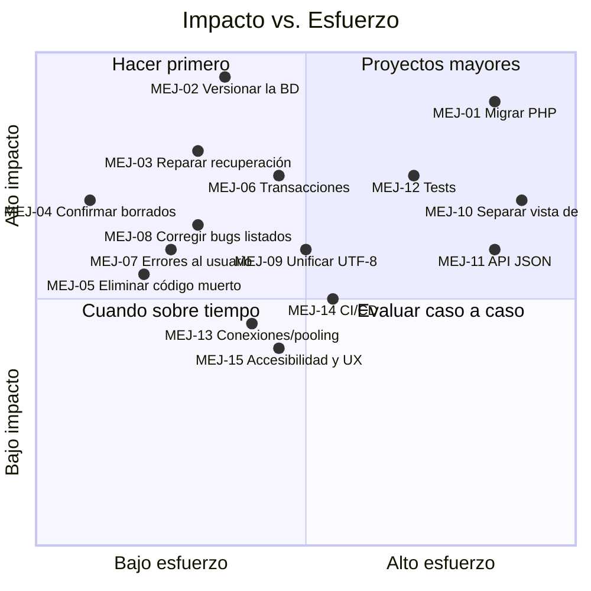
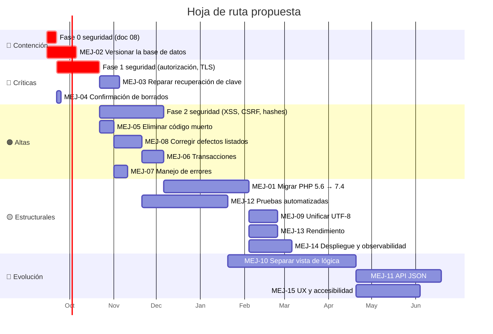

# 09 · Mejoras propuestas y deuda técnica

> Las mejoras de **seguridad** tienen su propio plan priorizado en
> [`08-seguridad.md`](08-seguridad.md) §5. Este documento cubre el resto: corrección
> funcional, mantenibilidad, rendimiento, operación y experiencia de usuario.

## 1. Matriz de priorización

## 2. Deuda crítica (bloquea la continuidad del sistema)

### MEJ-01 · Migrar a una versión de PHP con soporte
**Impacto: alto · Esfuerzo: alto · Riesgo de no hacerlo: crítico**

PHP 5.6 no recibe parches de seguridad desde el 31-12-2018. Muchos proveedores de
hosting ya no lo ofrecen, por lo que **un cambio de servidor obligaría a migrar sin plazo**.

Trabajo requerido (ver la tabla de incompatibilidades en [`02-stack-tecnologico.md`](02-stack-tecnologico.md) §1):
1. Sustituir las llamadas estáticas a métodos de instancia (`Wiss::Query(...)` → `$this->Query(...)`).
2. Reemplazar `utf8_encode`/`utf8_decode` por `mb_convert_encoding` (o eliminar la doble conversión, MEJ-09).
3. Blindar los accesos a índices de array inexistentes (`isset`/`??`).
4. Renombrar el método `Clone` de `cNeodoc.php` (o eliminar el archivo, MEJ-05).
5. Verificar la compatibilidad de `sqlsrv` con la versión destino.
6. Revisar propiedades dinámicas en `Certificado` (`$this->$tag`).

> 💡 Ruta sugerida: 5.6 → 7.4 (mismo estilo de código, ganancia de rendimiento notable)
> y luego evaluar 8.x. Intentar 5.6 → 8.3 de una vez multiplica el riesgo.

### MEJ-02 · Versionar el esquema y los procedimientos de la base de datos
**Impacto: crítico · Esfuerzo: medio**

🔴 **Este es el riesgo más grave de continuidad del proyecto**, por encima de cualquier
problema del código PHP: **toda la lógica de negocio vive en ~56 procedimientos almacenados
que no están en ningún repositorio.** Si se pierde la base de datos o el proveedor de
hosting da de baja el servicio, **el sistema es irrecuperable**: el código PHP por sí solo
no puede reconstruirse en funcionamiento.

Acciones:
1. Extraer el DDL completo (tablas, índices, claves, restricciones) y los
   `CREATE PROCEDURE` de los 56 procedimientos listados en
   [`03-modelo-datos.md`](03-modelo-datos.md) §2.
2. Versionarlos en `db/schema/` y `db/procedures/` dentro de este repositorio.
3. Adoptar migraciones numeradas para los cambios futuros.
4. Verificar y documentar la política de respaldos del proveedor.

### MEJ-03 · Reparar el flujo de recuperación de contraseña
**Impacto: alto · Esfuerzo: bajo-medio**

Hoy un usuario que olvida su contraseña **no puede recuperarla** (detalle en
[F-07](05-flujos-funcionales.md#f-07--recuperación-de-contraseña-inoperante)).
Son cuatro fallos encadenados que hay que corregir juntos:

1. `Steins::Gate()` debe devolver `ServidorCorreo`, `UsuarioCorreo` y `ClaveCorreo`
   (hoy solo devuelve datos de BD, y `Mail.php:16-18` los espera).
2. Eliminar el bypass `if (1 == 2)` de `Mail.php:44`.
3. Registrar `recover` en `gate/shortcut.php` para que la URL del enlace funcione.
4. Unificar el hash: `Autentificar` envía la contraseña sin transformar y
   `RecoverPassPush` envía MD5 — hay que decidir un único punto de hasheo (ver SEC-13).
5. Descomentar el enlace "Recuperar Contraseña" del formulario (`rLogin.php:12`).

## 3. Corrección funcional

### MEJ-04 · Añadir confirmación a las acciones destructivas
**Impacto: alto · Esfuerzo: muy bajo**

`$.DeleteUsuario`, `$.DeleteDocente`, `$.DeleteVacuna`, `$.DeleteSede`,
`$.DeleteUniversidad` y `$.DeleteCarrera` se ejecutan **con un solo clic, sin confirmación**.
Un clic accidental en el ícono de papelera —que está junto al de editar— borra el registro.

Corrección: diálogo de confirmación (el proyecto ya tiene `$.BlockModal`, `valk.core.js:139`),
o mejor, **borrado lógico con papelera y opción de restaurar**.

### MEJ-06 · Introducir transacciones en las operaciones compuestas
**Impacto: alto · Esfuerzo: medio**

Guardar un alumno con sus vacunas son **N+1 peticiones HTTP independientes** originadas
en el navegador (`jxUsuario.js`, `$.SaveUsuario` → `$.SaveVaccines`). Si el navegador se
cierra o falla una llamada intermedia, los datos quedan a medio escribir, sin forma de deshacerlo.

Corrección: un único endpoint que reciba el conjunto completo y un procedimiento almacenado
que envuelva las escrituras en `BEGIN TRAN / COMMIT / ROLLBACK`.

### MEJ-07 · Mostrar errores comprensibles al usuario
**Impacto: medio-alto · Esfuerzo: bajo**

Hoy, cuando algo falla:
- los errores de SQL Server se devuelven como HTML crudo y se pintan en la página
  (`SqlServer.php:44-52`);
- los errores de PHP están silenciados (`error_reporting(0)`) ⇒ el usuario ve una **pantalla en blanco**;
- `$.ajax` no define ningún manejador `error` (está comentado en `valk.watchdog.js:41-50`)
  ⇒ un fallo de red deja el indicador de carga girando indefinidamente.

Corrección: capturar errores en el servidor, registrarlos en un log estructurado y devolver
un mensaje genérico; añadir un manejador `error` global en `$.ajaxSetup`.

### MEJ-08 · Corregir defectos identificados

| ID | Defecto | Ubicación | Efecto |
|---|---|---|---|
| BUG-01 | `$Permisos[0]['Estado']` sobre un array indexado por `IdPermiso` | `valk/ro/rLogin.php:99` | La sesión `admin` nunca se fija; `gate/alfa/` nunca se carga |
| BUG-02 | `IniciarSesion()` se llama con **2 argumentos** de 4 en el flujo de recuperación | `valk/ro/rLogin.php:309` | `IdTipoUsuario` y `IdUniversidad` indefinidos ⇒ perfil incorrecto |
| BUG-03 | `LoadPaginacion` recorre `$Busqueda` como si fuera una lista, pero `GetPaginadoTotal` ya devuelve `[0]` | `xUsuario.php:388-393` | Cálculo del total frágil |
| BUG-04 | `GetPaginadoTotal` se invoca con **9 argumentos** y solo acepta 6 | `xUsuario.php:376-386` vs. `cUsuario.php:59` | Los 3 sobrantes se descartan silenciosamente |
| BUG-05 | `$V['Fecha']->format(...)` sin comprobar `null` | `xVacuna.php:107,134`; `cCertificado.php:158-163` | *Fatal error* si la fecha es nula |
| BUG-06 | `$.ResultadosPorSede` usa `setTimeout(…, 500)` en paralelo a la petición del filtro | `jxUsuario.js` | Condición de carrera: la tabla puede pintarse con el filtro anterior |
| BUG-07 | `$.LoadSelectVacuna` invoca `LoadSelectSede` (copiar-pegar) | `jxVacuna.js:9-17` | Rellena el `<select>` de vacunas con sedes |
| BUG-08 | El bucle de shortcuts tiene un `break` incondicional | `alphonse.php:166` | Solo se evalúa el primer segmento de la URL |
| BUG-09 | `header("location:")` con valor vacío al final del router | `alphonse.php:172` | Cabecera inválida; funciona por accidente |
| BUG-10 | Regex de `fonts` con el literal `(PENDIENTE)` | `alphonse.php:43` | La rama nunca coincide; el bloque `/u/` está vacío |
| BUG-11 | `$ps` usado fuera de su bucle `foreach` | `valk/mu/v1.0/Scripts.php:63` | Usa el `Async` del último elemento iterado |
| BUG-12 | `switch` con `break` duplicado tras `default` | `valk/ro/rLogin.php:87-89` | Código inalcanzable |
| BUG-13 | `
vacunarow"` — comilla sobrante en el nombre de clase | `xVacuna.php:97` | El estilo no aplica a ese contenedor |
| BUG-14 | `<td>` sin cerrar y `</td>` duplicado | `xCarrera.php:69,90` | HTML inválido |
| BUG-15 | Nombre de archivo del PDF consolidado con resolución de 1 segundo | `xCertificado.php:62` | Dos peticiones simultáneas se pisan |
| BUG-16 | `PostgreSql::Ejecutar()` referencia `constant('Debug_Steins')`, que no está definida | `PostgreSql.php:22` | *Fatal error* si se usara PostgreSQL |
| BUG-17 | El heartbeat no tiene bucle (su `setTimeout` está comentado) | `valk.watchdog.js:15-30` | No detecta expiraciones de sesión posteriores |
| BUG-18 | `Excel()` (`tExcel.php`) nunca se invoca desde la aplicación | — | Funcionalidad de exportación no disponible pese a estar implementada |

### MEJ-09 · Unificar la codificación de caracteres
**Impacto: medio · Esfuerzo: medio**

La cadena `utf8_decode` en la entrada → `utf8_encode` selectivo en algunos campos →
`utf8_decode` para FPDF (detallada en [`03-modelo-datos.md`](03-modelo-datos.md) §4) es
inconsistente y corrompe acentos y `ñ` en varios caminos.

Corrección: UTF-8 de extremo a extremo (`utf8mb4`/`NVARCHAR`, `mb_*`), con conversión a
Latin-1 **únicamente** en el punto de entrada a FPDF, encapsulada en un solo helper.

## 4. Mantenibilidad

### MEJ-05 · Eliminar el código muerto
**Impacto: medio-alto · Esfuerzo: bajo**

Aproximadamente el **40 % del repositorio no participa del producto**. Eliminarlo reduce
superficie de ataque, tiempo de comprensión y ruido en las búsquedas:

| A eliminar | Motivo | Referencia |
|---|---|---|
| `gate/class/cNeodoc.php` | De otro producto; no está en `construct.php` | — |
| `vendor/Facebook/`, `vendor/Google/` | Módulos desactivados; el `doorlock.php` de Facebook está corrupto | `manifest.php:28-30` |
| `vendor/Jodit/` | Desactivado | `manifest.php:31` |
| `valk/mu/v1.0/RedSocial.php`, `valk/endpoint.php` | Login social desactivado | — |
| `valk/mu/v1.0/Chat.php`, `valk/commands/wChat.php` | Sin interfaz | — |
| `valk/mu/v1.0/{Kratos,Odin,Watchdog,Test}.php` | Esqueletos vacíos o inertes | — |
| `valk/mu/cUploadHandler.php`, `valk/ro/rUploader.php`, `img/user/` | Subida no usada — **además vulnerable** | [SEC-02](08-seguridad.md) |
| `test.php`, `valk/test.php`, `valk/ro/rDebug.php` | Depuración expuesta | [SEC-12](08-seguridad.md) |
| `valk/gate.php` | Canal alternativo sin cliente | — |
| `valk/keys.php` | Huérfano: nunca surte efecto | [`01-arquitectura.md`](01-arquitectura.md) §6 |
| `valk/js/v1.0/{bootstrap*,jQuery.print*,jquery.fileupload}.js`, `valk/css/v1.0/bootstrap.css` | No se cargan | `Scripts.php`, `Styles.php` |
| `gate/lang/`, `valk/mu/cXLSXWriter.php` | i18n sin uso; exportación nunca invocada | — |
| Bloques comentados extensos (`WriteHTML`, `Signature` >6, registro) | Ruido | varios |

> ⚠️ Hacerlo **después** de versionar la base de datos (MEJ-02) y con el repositorio
> limpio, para poder revertir.

### MEJ-10 · Separar presentación de lógica
**Impacto: alto · Esfuerzo: alto**

Hoy `gate/omega/xUsuario.php` (666 líneas) mezcla consultas, reglas de negocio, HTML y
JavaScript en línea, en funciones globales sin retorno. Consecuencias: imposible de
testear, imposible de reutilizar, y el XSS de [SEC-08](08-seguridad.md) es estructural.

Ruta incremental sugerida (sin reescribir todo):
1. Extraer el HTML a archivos de plantilla con auto-escapado.
2. Convertir las funciones globales en métodos de clases controladoras.
3. Mover las reglas de negocio a servicios independientes de la petición.

### MEJ-11 · Devolver JSON en lugar de fragmentos HTML
**Impacto: medio · Esfuerzo: alto**

El contrato actual (HTML por AJAX) impide reutilizar la lógica desde una app móvil,
una integración con universidades o pruebas automatizadas. Migrar endpoint a endpoint a
JSON con renderizado en cliente permitiría además versionar el contrato.

### MEJ-12 · Introducir pruebas automatizadas
**Impacto: alto · Esfuerzo: alto**

No existe **ni un solo test** en el repositorio. Cualquier cambio se valida a mano.

Orden sugerido por relación valor/esfuerzo:
1. Pruebas de humo HTTP sobre los flujos críticos (login, ver ficha, generar certificado).
2. Pruebas de la capa de datos contra una base de pruebas.
3. Pruebas unitarias de utilidades puras (`FormatearFecha`, `ArrayToXml`, `DecodePost`) —
   son las más fáciles y ya tienen contratos claros.
4. Pruebas de regresión de seguridad: verificar que cada función del catálogo
   [`07-catalogo-endpoints.md`](07-catalogo-endpoints.md) devuelve 403 sin la sesión adecuada.

## 5. Rendimiento

### MEJ-13 · Reducir el coste por petición
**Impacto: medio · Esfuerzo: medio**

| Problema | Ubicación | Propuesta |
|---|---|---|
| Una conexión TCP nueva a SQL Server **por consulta** | `SqlServer.php:38,63` | Reutilizar la conexión durante la petición; evaluar *connection pooling* |
| Cada petición incluye y parsea **los 9 controladores completos** | `gatekeeper.php:12-31` | Cargar solo el archivo que contiene la función solicitada |
| `Wiss::__construct` vuelve a hacer `require` del preloader completo | `Wiss.php:30` | Reutilizar la configuración ya cargada |
| `encrypt_decrypt()` recarga el preloader **en cada llamada** | `tEncode.php:178` | Leer las claves de configuración ya cargada |
| El PDF descarga el logo y la firma **por HTTP desde el propio servidor** | `cCertificado.php:14,62` | Usar rutas del sistema de archivos |
| `LoadResultadosPaginado` + `LoadPaginacion` = **2 consultas pesadas** por página | `xUsuario.php` | Devolver el total junto con la página (`COUNT(*) OVER()`) |
| Sin caché de catálogos (universidades, sedes, carreras, vacunas se consultan en cada render) | `xSede.php`, `xCarrera.php`, … | Cachear en sesión (el mecanismo `SetSesionCache` ya existe) |
| `cache/` sin invalidación automática | `scripts.php`, `styles.php` | Nombrar los archivos por *hash* del contenido |

## 6. Operación

### MEJ-14 · Establecer un proceso de despliegue
**Impacto: medio · Esfuerzo: medio**

No hay entorno de pruebas declarado, ni script de despliegue, ni forma de revertir.
El cambio de entorno se hace **editando `manifest.php` a mano**, con riesgo de publicar
con `Entorno_Developer = 1`.

Propuesta: configuración por variables de entorno; script de despliegue idempotente
(copiar → crear directorios → limpiar caché → verificar salud); un entorno de pruebas
espejo; y un `git tag` por versión publicada.

### Observabilidad mínima

| Falta | Propuesta |
|---|---|
| Log estructurado | Sustituir `Log2()` (texto plano en la raíz web) por logs con nivel, fuera del document root |
| Auditoría de accesos | Conectar `Morty` (ya implementado) — ver [SEC-21](08-seguridad.md) |
| Health check | Endpoint `/health` que verifique BD, escritura en `out/` y espacio en disco |
| Alertas | Notificación ante errores de BD o fallos de generación de PDF |
| Métricas de negocio | Certificados emitidos por día, alumnos activos, universidades con actividad |

## 7. Experiencia de usuario y accesibilidad

### MEJ-15 · Mejoras de UX/A11y
**Impacto: medio · Esfuerzo: medio**

| Observación | Ubicación |
|---|---|
| Acciones destructivas sin confirmación (ver MEJ-04) | `jx*.js` |
| Sin retroalimentación ante error de red (el *spinner* queda girando) | `valk.watchdog.js` |
| Elementos interactivos construidos con `
` en vez de `<button>`: no accesibles por teclado ni por lectores de pantalla | ubicuo en `gate/omega/` |
| Íconos sin texto alternativo; solo atributo `title` | `gate/omega/` |
| El estado de los filtros vive en atributos `data-*` del DOM: se pierde al recargar y no es compartible por URL | `xDashboard.php` |
| Sin indicación de progreso en la generación de certificados masivos | `jxCertificado.js` |
| Mensajes de error de login revelan si la cuenta existe | ver [SEC-15](08-seguridad.md) |
| Sin diseño adaptable declarado más allá del `viewport`; el panel de administración usa una grilla ancha | `gate/css/` |
| Textos de términos y condiciones en inglés y con `[forum-name]` | `valk/ro/rValk.php` |

## 8. Hoja de ruta sugerida

> ⚠️ Las fechas son **relativas y orientativas**: representan orden y magnitud, no un
> compromiso de calendario. Lo único que no admite postergación es la **Fase 0** y
> **MEJ-02** (versionar la base de datos), que pueden ejecutarse en paralelo.

## 9. Decisión de fondo: ¿mantener o reescribir?

| Criterio | Mantener y corregir | Reescribir |
|---|---|---|
| Costo inicial | Bajo | Alto |
| Riesgo de regresión funcional | Bajo | Alto (la lógica está en los procedimientos, no en el PHP) |
| Tiempo hasta un sistema seguro | Semanas (Fases 0–1) | Meses |
| Sostenibilidad a 5 años | Baja (framework propietario sin comunidad) | Alta |
| Facilidad para incorporar personal | Muy baja | Alta |

**Recomendación:** ejecutar **primero** la contención y las Fases 0–1 de seguridad y
MEJ-02 sobre el sistema actual — son inaplazables y de bajo costo. Con el sistema estable
y la base de datos versionada, evaluar la reescritura de la **capa PHP** (manteniendo el
esquema y los procedimientos almacenados, que son el activo real) sobre un framework con
soporte. Los procedimientos almacenados permiten migrar la aplicación **sin tocar los
datos ni la lógica de negocio**, lo que hace la reescritura mucho menos arriesgada de lo habitual.
